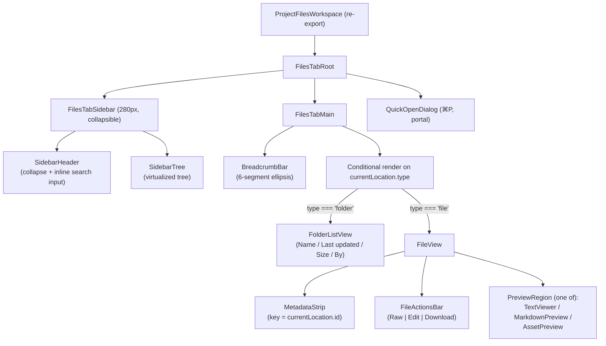
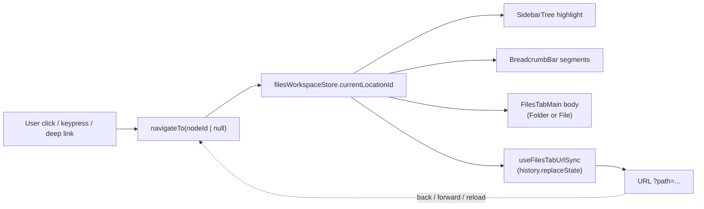
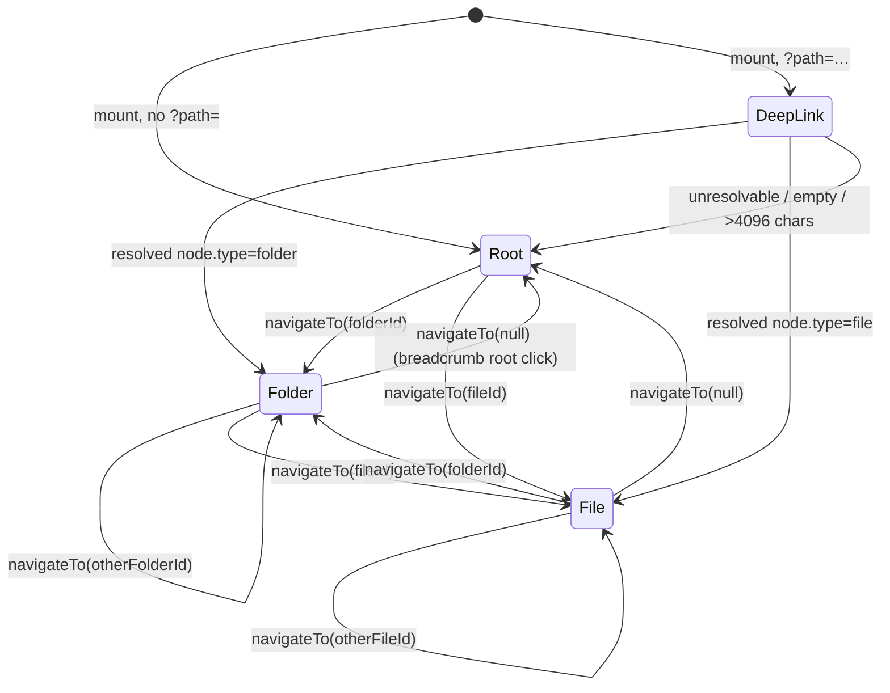
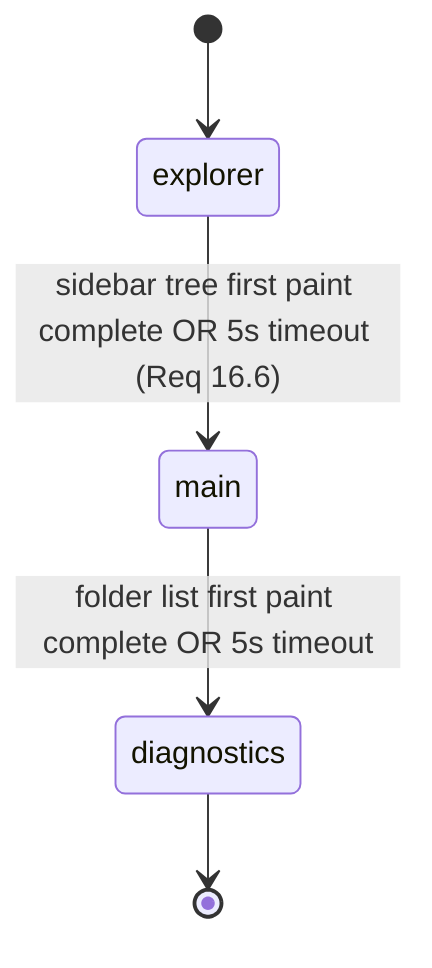

# Design Document

## Overview

The Files tab is being rebuilt from a mini-IDE into a GitHub-style code browser. This design replaces `src/components/projects/v2/workspace/WorkspaceShell.tsx` with a new component `FilesTabRoot` and a thin, browse-first component tree. Layout is **Option B — GitHub + Minimal Tree**:

- A fixed-width (280px) collapsible `FilesTabSidebar` on the left holding a single tree with an inline search
- A `FilesTabMain` column on the right containing a GitHub-style `BreadcrumbBar` above either a `FolderListView` or a `FileView`
- One file visible at a time. No editor tabs. No split panes. No bottom console. No command palette.

The design is constrained by two explicit quality mandates from the requirements:

1. **Requirement 17 (Metadata Bug)**: the metadata panel has historically shown stale data for a file that was just closed. The new design eliminates the bug structurally, not by patch. The metadata is rendered inside a `MetadataStrip` that is keyed by `currentLocationId`, mounted only when `currentLocation.type === "file"`, and carries no shared or parent state. When `currentLocation` transitions file → folder (or file → different file), React unmounts and remounts the component, guaranteeing a fresh render.
2. **Requirement 18 (E2E verification)**: every remaining feature must be verified end-to-end before the spec is complete. This is a tasks-phase obligation, but the design makes it testable by keeping the navigation model tight and single-sourced (property 2 below).

The other central constraint is **Requirement 15 (Explicit Removals)**: a large surface area of the existing implementation must not merely be hidden — it must be removed so the mount lifecycle stops loading it (Requirement 16.1–16.3). This design specifies a concrete decommissioning list.

### Scope Boundary

This spec is **only** the Files tab. Per Requirement 21.7–21.8, shared modules (`filesWorkspaceStore`, `src/app/actions/files/*`, `src/lib/db/schema.ts`) must preserve their public API for other consumers — notably the Tasks tab, which reads `nodesById`, `childrenByParentId`, and `taskLinkCounts` from `filesWorkspaceStore`. Removal of store keys is scoped to keys that are only used by the deleted Files-tab surfaces.

## Architecture

### Component Tree

`FilesTabRoot` replaces `WorkspaceShell` as the single entry point for the Files tab. `src/components/projects/v2/ProjectFilesWorkspace.tsx` (which today re-exports `WorkspaceShell`) will re-export `FilesTabRoot` behind a feature flag.



### Data Flow

Four surfaces (tree highlight, breadcrumb, main area content, URL) all subscribe to a **single source of truth**: `currentLocationId: string | null` on the files workspace store.



There is exactly one write path to `currentLocationId`: the `navigateTo` action. Every navigation surface funnels through it. This is how the tree ⇄ breadcrumb ⇄ main ⇄ URL invariant (Requirement 6.5, Requirement 20.1) is guaranteed architecturally, not by inspection.

### New Directory Layout

```
src/components/projects/v2/
  files-tab/                          ← NEW top-level folder for the redesign
    FilesTabRoot.tsx                  ← replaces WorkspaceShell
    FilesTabSidebar.tsx
    FilesTabMain.tsx
    breadcrumb/
      BreadcrumbBar.tsx               ← new, replaces navigation/BreadcrumbBar.tsx
    folder/
      FolderListView.tsx
      FolderListRow.tsx
      FolderListHeader.tsx
      FolderListStates.tsx            ← loading / empty / error
    file/
      FileView.tsx
      MetadataStrip.tsx               ← fix for Requirement 17
      FileActionsBar.tsx
      TextViewer.tsx                  ← Raw + Edit surface
    quick-open/
      QuickOpenDialog.tsx             ← simplified from existing
    hooks/
      useCurrentLocation.ts
      useNavigateTo.ts
      useFilesTabUrlSync.ts
      useDeepLinkResolver.ts
      useFilesTabStartupStage.ts
      useFolderContents.ts            ← wraps getChildren with loading / error
  preview/                            ← UNCHANGED — reused by FileView
    AssetPreview.tsx
    MarkdownPreview.tsx
```

`FilesTabSidebar` internally uses a trimmed fork of `ExplorerTree` (the existing virtualized tree renderer from `src/components/projects/v2/explorer/ExplorerTree.tsx`) without the saved-views, outline, source-control, insights, and command-palette surfaces. The tree renderer itself — which is the valuable part — is kept.

### Replaced Entry Point

- **Today**: `ProjectLayout.tsx` renders `ProjectFilesWorkspace`, which re-exports `WorkspaceShell`. `WorkspaceShell` owns `selectedNodeId`, pane tabs, split layout, bottom panel, and the lifecycle hooks.
- **Tomorrow**: `ProjectFilesWorkspace` re-exports `FilesTabRoot` when `filesTabV3Enabled` is true; otherwise falls through to `WorkspaceShell`. After rollout completes, `WorkspaceShell` and its sub-modules are deleted in one sweep (see Removal Plan).

## Components and Interfaces

### `FilesTabRoot` (replaces `WorkspaceShell`)

Owns the top-level mount and the single-write-path navigation action. Does **not** own tabs, panes, bottom panel state, or editor prefs.

```ts
interface FilesTabRootProps {
  projectId: string;
  projectName?: string;
  currentUserId?: string;
  isOwnerOrMember: boolean;                     // → role: Role_Owner | Role_Member | Role_Viewer
  isActive?: boolean;
  syncStatus?: "pending" | "cloning" | "indexing" | "ready" | "failed";
  initialOpenPath?: string | null;              // legacy deep-link prop, honored
  // Note: initialOpenLine / initialOpenColumn are dropped — no editor, no line targeting
}
```

Responsibilities:

1. Call `useFilesTabStartupStage()` to sequence mount.
2. Call `useDeepLinkResolver()` once `stage === "main"` to resolve `?path=` into `currentLocationId`.
3. Call `useFilesTabUrlSync()` to mirror `currentLocationId` → URL via `history.replaceState`.
4. Render `FilesTabSidebar` + `FilesTabMain` + `QuickOpenDialog`.
5. Register global `⌘P` keyboard handler that toggles `QuickOpenDialog` (Requirement 9.1).
6. Pass the user role down via React context (`FilesTabRoleContext`) so `FileActionsBar`, `FolderListRow`, etc., can decide whether to show Edit/Delete/Rename controls without drilling props.

### `FilesTabSidebar`

```ts
interface FilesTabSidebarProps {
  projectId: string;
  role: Role;
  canEdit: boolean;
}
```

- Fixed width: **280px** when visible; **0px** when collapsed (Requirement 2.5–2.7, 15.14).
- Header row: 32px, contains the collapse toggle (`PanelLeftClose` icon) and an inline search `<input>`.
- Search filter semantics match Requirement 2.2 (case-insensitive substring match over node name, with ancestors retained).
- Tree body: reuses the virtualized `ExplorerTree` renderer from the current implementation but with a trimmed `contextValue` — no multi-select checkboxes (open question 1), no git toolbar, no insights, no outline.
- Subscribes to `currentLocationId` for the highlight row.
- Emits `navigateTo(node.id)` on row click or keyboard Enter. Passes the store's `toggleExpanded` through for expand/collapse.
- Does **not** render a resize handle. Requirement 15.14.

### `FilesTabMain`

```ts
interface FilesTabMainProps {
  projectId: string;
  role: Role;
  canEdit: boolean;
}
```

Internally:

```tsx
const location = useCurrentLocation(projectId); // null | FolderLocation | FileLocation
return (
  <div className="flex-1 flex flex-col min-w-0 h-full">
    <BreadcrumbBar projectId={projectId} location={location} />
    {location === null || location.type === "folder"
      ? <FolderListView projectId={projectId} folderId={location?.id ?? null} canEdit={canEdit} />
      : <FileView key={location.id} projectId={projectId} node={location.node} canEdit={canEdit} />}
  </div>
);
```

Note the `key={location.id}` on `FileView`. This is the architectural hook for Requirement 17: when `currentLocation` changes from one file to another (or from a file to a folder), React unmounts `FileView` (and its `MetadataStrip` child) and mounts a fresh tree.

### `BreadcrumbBar`

```ts
interface BreadcrumbBarProps {
  projectId: string;
  location: CurrentLocation | null;
}
```

- Single-row flex container, `overflow-x-auto`.
- Segments derived synchronously via `ancestorChain(nodesById, location.id)` — no async `getBreadcrumbs` call when ancestors are already in store. Falls back to `getBreadcrumbs` action only when the ancestor chain is not fully loaded (deep-link arrival case).
- Separator: `/` between segments (Requirement 3.1).
- Last segment:
  - If `location.type === "folder"`: clickable (no-op self-navigation, but focusable).
  - If `location.type === "file"`: bold, non-clickable (Requirement 3.3).
- Truncation (Requirement 3.6): when `segments.length > 6`, render `segment[0]` + an ellipsis button + `segments.slice(-4)`. The ellipsis button opens a dropdown listing the hidden segments.
- Every clickable segment calls `navigateTo(segment.id)` on click — no local state.

### `FolderListView`

```ts
interface FolderListViewProps {
  projectId: string;
  folderId: string | null;   // null = project root
  canEdit: boolean;
}
```

- Renders a table with a fixed header row: Name, Last updated, Size, By (Requirement 4.3).
- Row height: 40px.
- Sort: folders first, then alphabetical case-insensitive with id tie-break (Requirement 4.2).
- Loading state: header + spinner row (Requirement 4.9).
- Empty state: header + "This folder is empty" indicator (Requirement 1.4, 4.9).
- Error state: header + inline error with Retry button (Requirement 4.10).
- Row content:
  - Folder icon or file-type icon + name link (click = `navigateTo(row.id)`)
  - `VersionPill` next to the name when `currentVersion > 1` (Requirement 11.1)
  - Favorite star toggle (Requirement 8.1)
  - Git change badge (M / A / D) on the right of the Name column, only when `filesFeatureFlags.wave4GitIntegration` and a change is recorded for the node (Requirement 12.1–12.6)
- Row hover: subtle zinc-50 / zinc-900 background.
- Contains **no** drag-handle, **no** multi-select checkboxes by default (flagged as open question 1).
- `canEdit` toggles the upload / create / rename / delete context menu and the drop-target affordance (Requirement 7.1–7.2).

Internally, `FolderListView` uses `useFolderContents(projectId, folderId)` — a new hook that wraps the existing store's `childrenByParentId[parentKey]` selector plus the existing `loadFolderContent` action from `useExplorerBoot`. The hook returns `{ status: "loading" | "ready" | "error", children, retry }`.

### `FileView`

```ts
interface FileViewProps {
  projectId: string;
  node: ProjectNode;        // guaranteed node.type === "file"
  canEdit: boolean;
}
```

Structure (top to bottom):

```
┌ MetadataStrip ───────────────────────────────┐
│ name  • 12.4 KB  • v3  • 2026-05-10T14:23:00Z│
│ updated by Alex  • image/png                 │
│                       [Raw] [Edit] [Download]│
└──────────────────────────────────────────────┘
┌ PreviewRegion ───────────────────────────────┐
│  (one of: TextViewer, MarkdownPreview,       │
│   AssetPreview for image/video/audio/PDF)    │
└──────────────────────────────────────────────┘
```

Preview selection logic matches Requirement 13:

```ts
function pickPreview(node: ProjectNode) {
  const kind = fileKind(node); // "image" | "video" | "audio" | "pdf" | "doc" | "text" | "binary"
  if (kind === "image" || kind === "video" || kind === "audio" || kind === "pdf" || kind === "doc") {
    return <AssetPreview node={node} signedUrl={...} />;
  }
  if (isMarkdown(node)) return <MarkdownPreview content={...} />;
  if (kind === "text") return <TextViewer node={node} canEdit={canEdit} />;
  return <BinaryFallback node={node} />;
}
```

The `AssetPreview` and `MarkdownPreview` components from `src/components/projects/v2/preview/` are reused unchanged. Requirement 13 explicitly says to reuse the existing components. **`AssetMetadataPanel.tsx` is NOT reused** — it is replaced by `MetadataStrip` as part of the Requirement 17 fix. See "Metadata Bug Fix" below.

### `MetadataStrip` (NEW — fixes Requirement 17)

```ts
interface MetadataStripProps {
  node: ProjectNode;                     // invariant: node.id === currentLocation.id
  canEdit: boolean;
  onRaw: () => void;
  onEdit: () => void;
  onDownload: () => void;
}
```

Key design decisions:

- Rendered **only** when `currentLocation.type === "file"`.
- Mounted with a React key equal to `currentLocation.id`, applied at its parent (`FileView`) so when `currentLocation.id` changes, the entire component unmounts and remounts.
- No shared state. All metadata is derived from the `node` prop.
- Image-dimension and media-duration side effects (currently in `useImageDimensions` / `useMediaDuration` inside `AssetMetadataPanel`) are moved into sub-hooks that run only when this component is mounted. They cannot outlive the component.
- Exports a test-only prop `data-node-id={node.id}` on its root element so the PBT in the testing strategy can assert `metadataStripNodeId === currentLocationId` via a DOM query without reaching into React internals.

Render:

```tsx
export function MetadataStrip({ node, canEdit, onRaw, onEdit, onDownload }: MetadataStripProps) {
  // dev-only invariant assertion
  if (process.env.NODE_ENV !== "production") {
    console.assert(node.id, "MetadataStrip requires node.id");
  }
  return (
    <div data-testid="files-tab-metadata-strip" data-node-id={node.id} className="sticky top-0 z-10 ...">
      <div className="flex-1 min-w-0">
        <span className="font-medium">{node.name}</span>
        <Sep />
        <span>{formatBytes(node.size)}</span>
        <Sep />
        {node.currentVersion > 1 && <VersionPill v={node.currentVersion} />}
        <Sep />
        <time dateTime={toIso(node.updatedAt)}>{toIso(node.updatedAt)}</time>
        <Sep />
        <span>by {updatedByName(node)}</span>
        <Sep />
        <span>{(node.mimeType || "—").toLowerCase()}</span>
      </div>
      <div className="flex gap-1">
        <button onClick={onRaw}>Raw</button>
        {canEdit && <button onClick={onEdit}>Edit</button>}
        <button onClick={onDownload}>Download</button>
      </div>
    </div>
  );
}
```

Missing fields are rendered as `—` per Requirement 5.9.

### `QuickOpenDialog`

Simplified from the existing WorkspaceModalsHost QuickOpen portion.

```ts
interface QuickOpenDialogProps {
  projectId: string;
  open: boolean;
  query: string;
  onQueryChange: (q: string) => void;
  onOpenChange: (open: boolean) => void;
}
```

- Keybind: `⌘P` / `Ctrl+P` toggles open (Requirement 9.1); `Escape` closes without mutation (Requirement 9.7).
- Empty query: show up to 20 Recents from localStorage `files-recent-open:{projectId}` (Requirement 9.2, 8.5).
- Non-empty query: fuzzy-rank up to 50 files by name+path, debounced to 200ms (Requirement 9.3).
- Selecting a file calls `navigateTo(file.id)` and closes the dialog (Requirement 9.5).
- If the selected node no longer exists, show inline error and leave `currentLocation` unchanged (Requirement 9.6).

### Supporting Hooks

#### `useCurrentLocation`

```ts
type CurrentLocation =
  | { type: "root" }
  | { type: "folder"; id: string; node: ProjectNode }
  | { type: "file"; id: string; node: ProjectNode };

function useCurrentLocation(projectId: string): CurrentLocation | null;
```

Single selector derived from `currentLocationId` + `nodesById`. Returns `null` only when the store is uninitialized for the project. Returns `{ type: "root" }` when `currentLocationId === null`.

#### `useNavigateTo`

```ts
function useNavigateTo(projectId: string): (nodeId: string | null) => void;
```

Returns a stable callback that (a) calls `setCurrentLocation(projectId, nodeId)`, (b) expands every ancestor of `nodeId` in `expandedFolderIds` (Requirement 6.2–6.3), and (c) if `nodeId` resolves to a file, calls `addRecent(projectId, nodeId)` (Requirement 8.4).

This is the **only** write path to `currentLocationId`. Every component that triggers navigation uses this hook.

#### `useFilesTabUrlSync`

Subscribes to `currentLocationId`. When it changes, writes `history.replaceState` with the encoded `?path=` value (Requirement 10.4, 20.1). Also listens for `popstate` and re-reads the URL so browser back/forward work (Requirement 20.3).

#### `useDeepLinkResolver`

Runs once on mount (gated by `stage === "main"`). Reads `?path=` from `useSearchParams`. Validates: non-empty, decoded length ≤ 4096 (Requirement 10.5). Calls `findNodeByPathAny(projectId, pathParts)`. On success, calls `navigateTo(node.id)`. On failure, calls `navigateTo(null)` and surfaces an inline error in the main area (Requirement 10.5, 20.4).

#### `useFilesTabStartupStage`

```ts
type StartupStage = "explorer" | "main" | "diagnostics";
function useFilesTabStartupStage(projectId: string): StartupStage;
```

Drives staged mounting per Requirement 16. See "Startup Staging" section for the timing gates.

#### `useFolderContents`

Wraps the existing store state + `loadFolderContent` action to return `{ status, children, retry }` for a given folder id. Replaces the ad-hoc selectors currently strewn across `ExplorerShell`.

## Data Models

### Store Changes to `filesWorkspaceStore`

The existing store has grown dozens of keys that are specific to the mini-IDE. This section inventories every key and classifies it.

#### KEPT (used by the new Files tab and/or other consumers like Tasks tab)

Per-project state (`ProjectWorkspaceState`):

- `treeVersion`, `tabsVersion`, `selectionVersion` — bump counters used by memoized selectors
- `explorerMode` — constrained to `"tree"` in the new tab (other modes hidden/deleted). Kept as-is to preserve shared type.
- `viewMode` (`"code" | "assets" | "all"`) — Kept; unused by the new Files tab default render but kept to preserve the public API consumed by the Tasks tab's file picker. Value defaults to `"code"`.
- `expandedFolderIds` — drives sidebar tree expansion state
- `searchQuery` — inline sidebar search input (Requirement 2.2)
- `favorites` — star toggles (Requirement 8)
- `recents` — in-store recents list; also mirrored to localStorage (Requirement 8.5)
- `nodesById`, `childrenByParentId`, `loadedChildren`, `folderMeta` — node cache, shared with Tasks tab
- `taskLinkCounts` — used by Tasks tab (Requirement 21.8 — must preserve)
- `signedUrls` — shared caching for `AssetPreview`
- `git.changedFiles`, `git.repoUrl`, `git.branch`, `git.gitStatusLoaded` — for Change Indicators (Requirement 12)
- `sort`, `foldersFirst` — sidebar and folder-list sorting (Requirement 4.2)
- `locksByNodeId` — retained as a shared read-only surface, but the Files tab does not write to it (it no longer acquires edit locks)
- `ui.sidebarCollapsed` — drives the collapse state (Requirement 2.4)

#### DROPPED (specific to removed features — Requirement 15)

Per-project state:

- `splitEnabled`, `splitRatio` — split panes gone
- `panes` — editor tabs gone
- `pinnedByTabId` — tab pinning gone
- `fileStates` (the in-memory dirty-buffer cache) — no editor tabs means no per-tab content buffer. Replaced by a simple fetch-on-demand pattern inside `TextViewer`.
- `activeFileSymbols` — outline panel gone
- `requestedScrollPosition` — line deep-linking gone (Files tab is a browser, not a jump-to-line tool)
- `lastNodeEventsByNodeId` — insights panel gone
- `selectedNodeIds` — multi-select gone by default (see open question 1)
- `savedViews`, `viewModeByExplorerMode` — saved views gone (Requirement 15.18)
- `git.commitMessage`, `git.branches`, `git.syncInProgress`, `git.lastCommitSha`, `git.lastSyncAt` — git toolbar / source control panel gone. Only `changedFiles`, `repoUrl`, `branch`, `gitStatusLoaded` retained for Change Indicators.

`UiState` sub-slice (effectively rewritten):

- DROP: `bottomPanelTab`, `bottomPanelHeight`, `bottomPanelCollapsed`, `_prevBottomPanelCollapsed`, `zenMode` (Requirement 15.1–15.2, 15.7, 15.10)
- DROP: `lastExecutionOutput`, `lastExecutionSettingsHref`, `stdinInputText`, `problems`, `commandHistory`, `outputFilterMode` (Requirement 15.3, 15.5–15.7)
- DROP: `searchReplaceOpen`, `commandPaletteOpen` (Requirement 15.11)
- DROP: `sidebarWidth` — replaced by constant 280 (Requirement 2.6, 15.14)
- KEEP: `quickOpenOpen`
- KEEP: `sidebarCollapsed`

Store actions dropped (Requirement 15 consequences):

- `setSplitEnabled`, `setSplitRatio`
- `openTab`, `closeTab`, `setActiveTab`, `reorderTabs`, `moveTabToPane`, `pruneGhostTabs`, `pinTab`, `closeOtherTabs`, `closeTabsToRight`
- `setFileState`, `setActiveFileSymbols`, `requestScrollTo`, `clearScrollRequest`
- `toggleBottomPanel`, `setBottomPanelTab`, `setBottomPanelHeight`
- `setLastExecutionOutput`, `setLastExecutionSettingsHref`, `setStdinInputText`
- `setProblems`, `clearProblems`, `applyQuickFix`, `pushCommandToHistory`
- `saveCurrentView`, `applySavedView`, `deleteSavedView`
- `toggleZenMode`
- `setSidebarWidth` (kept the action name as a no-op only if other consumers call it; otherwise deleted. Audit step: `grep_search setSidebarWidth` across all files outside the Files tab — see Removal Plan)
- `setSearchReplaceOpen`, `setCommandPaletteOpen`, `setOutputFilterMode`
- `setLock`, `clearLock`, `setLastNodeEventSummary`, `clearLastNodeEventSummary` — lock acquisition was tied to the editor; kept only as read-only selectors (remove the *write* actions if unused outside Files tab)
- `setGitSyncStatus`, `setGitCommitMessage`, `setGitBranches`, `setGitLastSync` — no git toolbar means no writers. The one remaining writer is the single `getGitStatus` fetch in `useFilesTabStartupStage` stage "diagnostics".

#### ADDED / RENAMED

Per-project state:

- **ADD**: `currentLocationId: string | null` — the single navigation source of truth. `null` means "at project root folder". Replaces `selectedNodeId` as the UI-visible selection.
- **RENAME**: `selectedNodeId` → **deprecate** in favor of `currentLocationId`. `selectedNodeId` is still written by the Tasks tab's file picker, so we keep the existing key but **the Files tab does not read or write it**. Instead, the Files tab reads/writes `currentLocationId`. This preserves Requirement 21.7.
- **KEEP** `ui.sidebarCollapsed`; **REMOVE** `ui.sidebarWidth` (width is a compile-time constant now).

New actions:

```ts
setCurrentLocation: (projectId: string, nodeId: string | null) => void;
// Atomically: (a) set currentLocationId, (b) bump selectionVersion, (c) ensure every ancestor of nodeId is expanded.
```

#### Invariant: "metadata matches selection"

Guaranteed architecturally by:

1. `currentLocationId` is the only navigation state in the store.
2. `MetadataStrip` is mounted only when `currentLocation.type === "file"`.
3. `MetadataStrip` receives its `node` prop from `useCurrentLocation` on every render — never from a cached parent state.
4. `FileView` is keyed by `currentLocation.id`, so React discards the subtree on any id change.

PBT hook: `MetadataStrip` renders `data-node-id={node.id}`. Property 2 (`metadata_matches_selection`) reads that attribute and asserts it equals the current `currentLocationId` for any render.

### Migration Note

Requirement 15.19: the Files tab **must ignore any legacy persisted state** for removed features on load.

- The Zustand `persist` middleware's `merge` function already filters persisted state through `defaultWorkspace()`. We extend the `partialize` to **stop persisting** the dropped keys (`splitEnabled`, `splitRatio`, `panes`, `pinnedByTabId`, `savedViews`, `viewModeByExplorerMode`, `prefs`).
- For users with existing localStorage blobs under `files-workspace-v2` that contain those keys, the updated `partialize` + `merge` will ignore them on next boot because `defaultWorkspace()` always supplies a fresh `panes`, `splitEnabled`, etc., and we overwrite with default values before merging the persisted partial.
- The persist store key is bumped from `files-workspace-v2` to `files-workspace-v3` to force a clean reset rather than rely on merge coincidence. The migration is one-way: users lose saved views and sidebar width preferences. This is acceptable per Requirement 15.19.

### URL Contract (detailed below in "URL Contract" section)

The `?path=` value is the single URL-encoded concatenation of node-name segments from the project root to the current location. Empty and over-length values are treated as "no path" (Requirement 10.5).

## Navigation Model

### State Machine

Navigation is a three-state machine keyed off the derived `CurrentLocation`:



Transition triggers (Requirement 6.1):

| Trigger | Resolver |
|---|---|
| Tree row click | `SidebarTree` → `navigateTo(node.id)` |
| Tree keyboard Enter | `SidebarTree` → `navigateTo(node.id)` (file) or `toggleExpanded` (folder) |
| Breadcrumb segment click | `BreadcrumbBar` → `navigateTo(segment.id)` |
| Breadcrumb root click | `BreadcrumbBar` → `navigateTo(null)` |
| Folder list row click | `FolderListRow` → `navigateTo(row.id)` |
| Quick-open selection | `QuickOpenDialog` → `navigateTo(file.id)` |
| Browser back / forward | `useFilesTabUrlSync` `popstate` → `navigateTo(resolvedId)` |
| Deep link arrival | `useDeepLinkResolver` → `navigateTo(resolvedId)` |

### Four-Surface Synchronization

The four observable surfaces all subscribe to the same `currentLocationId`:

1. **Tree highlight**: `SidebarTree` row whose `node.id === currentLocationId` gets the active style. Ancestors are expanded via `navigateTo`'s side-effect (Requirement 6.2–6.3).
2. **Breadcrumb**: `BreadcrumbBar` computes `ancestorChain(nodesById, currentLocationId)`.
3. **Main content**: `FilesTabMain` conditionally renders based on `useCurrentLocation()`.
4. **URL**: `useFilesTabUrlSync` writes `?path=encodePath(currentLocationId)`.

Because each surface's input is a pure function of the same source, they cannot diverge. The Requirement 6.5 property (tree ⇄ breadcrumb sync) falls out of this architecture rather than being enforced by code.

The Requirement 6.4 dev-mode assertion ("surface disagreement > 200ms is a defect") becomes a trivial dev-mode check inside `FilesTabMain`:

```ts
if (process.env.NODE_ENV !== "production") {
  useEffect(() => {
    const breadcrumb = computeBreadcrumb(nodesById, currentLocationId);
    const treeHighlight = currentLocationId; // tree is keyed by the same id
    if (breadcrumb.at(-1)?.id !== treeHighlight) {
      console.warn("[files-tab] tree ⇄ breadcrumb disagreement", { breadcrumb, treeHighlight });
    }
  }, [currentLocationId, nodesById]);
}
```

## Metadata Bug Fix (Requirement 17)

### Root Cause

Today, the metadata panel is rendered inside the asset viewer (`src/components/projects/v2/preview/AssetViewer.tsx`), which is rendered inside an editor tab. When the user closes the tab, the `closeTab` action in `WorkspaceTabManager` removes the tab from the pane's `openTabIds`, but:

1. The tab is not unmounted synchronously — React reconciles with the next pane render.
2. `AssetMetadataPanel` maintains local state (`useImageDimensions`, `useMediaDuration`) keyed off `signedUrl`, which continues to run effects even after the node reference is no longer the active selection, because the parent component (`EditorPane`) holds a stale `tab.nodeId` that points to the just-closed node until the next render settles.
3. The metadata panel is also shown inside an `AssetViewer` that is rendered under a parent `EditorPane` that does not unmount-remount cleanly on tab switch; it mutates props in place.

The net effect is that for a brief window after `closeTab`, the metadata panel renders values from the previous node. Users see stale data.

### Fix in the New Design

The fix is structural, not patch-based:

1. **No "closeTab" concept**. There are no tabs. `currentLocation` changes from file to folder via `navigateTo`.
2. **`MetadataStrip` is mounted only when `currentLocation.type === "file"`**. When the user navigates back to a folder, `FilesTabMain` switches the `<Body>` branch to `FolderListView`, and React unmounts the entire `FileView` subtree — including `MetadataStrip`. Requirement 17.1 is satisfied because the component is literally not in the rendered output.
3. **`FileView` is keyed by `currentLocation.id`**. When the user navigates from file A to file B, React unmounts the A subtree and mounts a fresh B subtree rather than reconciling in place. Requirement 17.2 and 17.4 are satisfied because no state from A survives the transition.
4. **`MetadataStrip` has no shared state**. Every field is derived from the `node` prop. The `useImageDimensions` / `useMediaDuration` effects are owned by `MetadataStrip` and cannot run after it unmounts.
5. **Property-based test hook**: the `data-node-id={node.id}` attribute on `MetadataStrip`'s root element lets a test run a fast-check property: for any sequence of navigations, query the DOM for `[data-testid="files-tab-metadata-strip"]` and assert the `data-node-id` attribute equals `currentLocationId` (or that the element is absent when `currentLocation.type !== "file"`).

**Why the key approach is sufficient**: React unmounts are synchronous and clean up effects synchronously. There is no "brief window" because the key change forces reconciliation to discard the old subtree before the new one mounts. The previous subtree's effects run their cleanup synchronously before the new subtree's effects fire.

## Removal Plan

Deletion priority (Requirement 15, Requirement 16.1–16.3). Each step is verified by `grep_search` for remaining imports before deletion. After each delete, run `npm run typecheck` and `npm run lint`.

### Priority 1: Runner Layer (Requirement 15.3, 16.1)

Delete the entire folder `src/lib/runner/`:

- `backend.ts`, `browser-sandbox.ts`, `contracts.ts`, `javascript.ts`, `local-analyzer.ts`, `prefs.ts`, `pyodide.ts`, `router.ts`, `runFile.ts`, `sql.ts`, `types.ts`, `typescript.ts`

Also delete `src/app/actions/parseStderrToProblems.ts`, which is only called from `WorkspaceShell.runActiveFile`.

Audit before delete: `grep_search` for `from "@/lib/runner/` and `from "@/app/actions/parseStderrToProblems"` — ensure no imports remain outside files that are themselves being deleted.

### Priority 2: Bottom Panel (Requirement 15.1–15.2, 16.2)

Delete `src/components/projects/v2/panels/`:

- `BottomPanel.tsx`, `RunTab.tsx`, `OutputTab.tsx`, `ProblemsTab.tsx`, `RunnerStatusStrip.tsx`, `ansiParser.ts`

### Priority 3: Workspace Shell Sub-Features

Delete from `src/components/projects/v2/workspace/`:

- `useCursorPresence.ts` (Requirement 15.13, 21.5)
- `cursorProtocol.ts` (ditto)
- `useLintOnEdit.ts` (Requirement 15.4, 16.3)
- `useWorkspaceLayoutState.ts` (split/resize pane logic — Requirement 15.8)
- `WorkspaceTabManager.ts` (Requirement 15.9)
- `WorkspacePaneHost.tsx` + the split logic inside (Requirement 15.8)
- `WorkspaceBottomPanelHost.tsx` (Requirement 15.1)
- `KeyboardShortcuts.tsx` (Requirement 15.12)
- `WorkspaceGitToolbar.tsx` (Requirement 12.3 — no source control panel)
- `WorkspaceSearchReplace.tsx` (Requirement 15.11 — no Cmd+K surface)
- `WorkspaceKeyboard.ts`, `WorkspaceLockManager.ts`, `WorkspaceAutoSave.ts`, `useWorkspaceLifecycle.ts`, `useWorkspaceUiState.ts`, `useWorkspacePane.ts`, `EditorPane.tsx`, `StatusBar.tsx`, `WorkspaceSyncOverlay.tsx`, `WorkspaceShell.tsx`, `indexQueueRuntime.ts`
- `WorkspaceModalsHost.tsx` — keep **only** the QuickOpen dialog portion, which is extracted to `files-tab/quick-open/QuickOpenDialog.tsx` first, then this file is deleted.
- `tab-manager/` subdirectory entirely

### Priority 4: Explorer Sub-Features

Delete from `src/components/projects/v2/explorer/`:

- `OutlinePanel.tsx` (Requirement 15.15)
- `SourceControlPanel.tsx` (Requirement 15.16, 12.3)
- `ExplorerInsightsHost.tsx` (Requirement 15.17)
- `ExplorerCommandPalette.tsx` (Requirement 15.11)
- `ExplorerBatchOps.tsx` — only if multi-select is dropped; retained pending open question 1
- `ExplorerDialogsHost.tsx` — simplified in place (keep create/rename/delete/move; drop saved-views UI)
- `ExplorerToolbarHost.tsx` — simplified to drop saved-views, outline, source-control, insights toggles
- `MultiFileDiffDialog.tsx` (part of source-control)

Keep the tree renderer core: `ExplorerTree.tsx`, `FileTreeItem.tsx`, `FileTreeRow.tsx`, `useExplorerBoot.ts`, `useExplorerDragDrop.ts`, `useExplorerMutations.ts`, `explorerTypes.ts`, `FileIcons.tsx`, `ExplorerContextMenu.tsx`, `ExplorerSearch.tsx`, `search.worker.ts`, `upload.worker.ts`. These are moved into `files-tab/` internals or kept in `explorer/` and imported by `FilesTabSidebar`.

Delete saved-views code inside `ExplorerShell.tsx` (the `handleSaveCurrentView`, `handleApplySavedView`, `handleDeleteSavedView`, `selectedSavedViewId` state), then replace `ExplorerShell.tsx` entirely with the new `FilesTabSidebar.tsx`.

### Priority 5: Store Slice Methods

Drop from `src/stores/files/` slices (Requirement 15.7, 15.11, 15.14, 15.18):

- `workspaceSlice.ts`: `setSplitEnabled`, `setSplitRatio`, `pinTab`, `closeOtherTabs`, `closeTabsToRight`, `openTab`, `closeTab`, `setActiveTab`, `reorderTabs`, `moveTabToPane`, `pruneGhostTabs`
- `uiSlice.ts`: `toggleBottomPanel`, `setBottomPanelTab`, `setBottomPanelHeight`, `setLastExecutionOutput`, `setLastExecutionSettingsHref`, `setStdinInputText`, `setProblems`, `clearProblems`, `applyQuickFix`, `pushCommandToHistory`, `setSidebarWidth`, `toggleZenMode`, `setSearchReplaceOpen`, `setCommandPaletteOpen`, `setOutputFilterMode`
- `explorerSlice.ts`: `saveCurrentView`, `applySavedView`, `deleteSavedView`
- `editorSlice.ts`: `setFileState`, `setActiveFileSymbols`, `requestScrollTo`, `clearScrollRequest` (the editor slice may be deleted entirely if no consumer outside Files tab reads it)
- `locksSlice.ts`: keep read-only state; drop `setLock` / `clearLock` writes — audit first
- `gitSlice.ts`: drop `setGitSyncStatus`, `setGitCommitMessage`, `setGitBranches`, `setGitLastSync`, `clearGitState`; keep `setGitRepo`, `setGitChangedFiles`, `setGitStatusLoaded`

### Audit Note (Requirement 21.8)

Before deleting **any** store method or key, run:

```
grep_search for each method name / key across the codebase
excluding src/components/projects/v2/workspace/**, src/components/projects/v2/panels/**, src/lib/runner/**
```

For each hit outside the Files-tab surface, either:

1. Leave the method/key in place (it's consumed by the Tasks tab or another surface) and note it in the tasks doc, **or**
2. Migrate the other consumer to the new API in the same tasks-phase PR.

Specifically named-as-shared (must preserve public API per Requirement 21.8):

- `upsertNodes`, `setChildren`, `setFolderPayload`, `setNodesAndChildren`, `markChildrenLoaded`, `setFolderMeta`, `removeNodeFromCaches`, `setTaskLinkCounts`, `setNodes`, `hydrateFromIdb`
- `toggleExpanded`, `setExplorerMode`, `setViewMode`, `setSelectedNode`, `setSelectedNodeIds`, `setSearchQuery`, `setSort`, `setFoldersFirst`, `addRecent`, `toggleFavorite`
- `nodesById`, `childrenByParentId`, `loadedChildren`, `folderMeta`, `taskLinkCounts`, `signedUrls`, `expandedFolderIds`, `favorites`, `recents`, `selectedNodeId`, `selectedFolderId`

### Feature Flag Gating During Removal

During the rollout (see Migration and Rollout), we **do not delete** the old modules. Both entry points coexist: `ProjectFilesWorkspace` renders `FilesTabRoot` when `filesTabV3Enabled` is true, `WorkspaceShell` otherwise. Deletion happens in one sweep **after** the flag is flipped to 100% and the on-call window is clean.

## Startup Staging

Three stages (Requirement 16.4). State machine:



Gating:

| Stage | Mounted | Fetches | Time budget (≤1000-node project) |
|---|---|---|---|
| `explorer` | `FilesTabSidebar` only. `FilesTabMain` is a spinner placeholder. | `loadFolderContent(null, "refresh")` (root listing only) | Sidebar interactive ≤ **500ms** (Req 16.5) |
| `main` | `FilesTabMain` → `BreadcrumbBar` + `FolderListView` / `FileView`. Deep-link resolver runs here. | `getBreadcrumbs` (if deep-link ancestors not cached) | Breadcrumb interactive ≤ **750ms** (Req 16.5) |
| `diagnostics` | No new components. `FolderListView` starts showing Change Indicators. | `getGitStatus` (only if `filesFeatureFlags.wave4GitIntegration`) | No gate; fire-and-forget |

**Explicit non-ops (Requirement 16.1–16.3):**

- No module under `src/lib/runner/` is imported or dynamically imported at any stage — after Removal Plan completes, the modules do not exist. Before that, the old `WorkspaceShell` path still loads them but is behind the flag.
- No `useLintOnEdit` scheduler, no `parseStderrToProblems` import, no `cursorProtocol` import.
- No `BottomPanel` mount.

**5-second timeout (Requirement 16.6):** `useFilesTabStartupStage` sets a 5s timer per stage. When it fires, the hook advances to the next stage regardless of whether the underlying fetch resolved, and logs a non-blocking warning to the console. Any state already built in earlier stages is preserved.

### Pseudo-code

```ts
function useFilesTabStartupStage(projectId: string): StartupStage {
  const [stage, setStage] = useState<StartupStage>("explorer");
  const { loadFolderContent } = useExplorerBoot({ projectId, ... });

  useEffect(() => {
    let cancelled = false;
    const timeout5s = (ms = 5000) => new Promise<void>(r => setTimeout(r, ms));

    (async () => {
      // Stage: explorer
      await Promise.race([loadFolderContent(null, "refresh"), timeout5s()]);
      if (cancelled) return;
      setStage("main");

      // Stage: main — handled by consumers. Advance after a microtask.
      await new Promise<void>(r => queueMicrotask(() => r()));
      if (cancelled) return;
      setStage("diagnostics");
    })();

    return () => { cancelled = true; };
  }, [projectId]);

  return stage;
}
```

Real implementation will measure first-paint via `requestIdleCallback` + `performance.mark` for the 500ms/750ms budgets (Requirement 16.5), and fail the build if a synthetic benchmark exceeds them.

## Visual Specifications

### Component-level

#### `FilesTabSidebar` (280px, collapsible)

```
┌────────────────────────────────────┐  ← 280px
│ [←] [🔍 Search files...]           │  ← 32px header
├────────────────────────────────────┤
│ ▸ 📁 src                           │  ← 28px rows, 20px indent/level
│ ▾ 📁 components                    │
│   ▸ 📁 ui                          │
│   ▾ 📁 v2                          │
│     • 📄 FileView.tsx    ⭐       │  ← star on hover
│     • 📄 TextViewer.tsx           │
│ ▸ 📁 lib                           │
│ • 📄 README.md                    │
└────────────────────────────────────┘
```

- Fixed width **280px**; no resize handle (Requirement 15.14).
- Collapse icon in header (left arrow) toggles `ui.sidebarCollapsed`. Collapsed = 0px wide, no border.
- Tree rows: 28px height; expand chevron (16px) + file/folder icon (16px) + name (truncates with ellipsis) + favorite star (16px, hover-only unless favorited).
- Active row (matches `currentLocationId`): subtle blue background, no bold.
- Search input: `type="text"`, 200ms debounce, case-insensitive substring filter; when empty, full tree shows with current expand/collapse state.

#### `BreadcrumbBar`

```
┌──────────────────────────────────────────────────────────────────┐
│ projectName  /  src  /  components  /  v2  /  FileView.tsx      │  ← 36px
└──────────────────────────────────────────────────────────────────┘
```

- Single-row flex container, `overflow-x-auto`.
- Last segment bold when `location.type === "file"`, not a button (Requirement 3.3).
- Each intermediate segment is a `<button>` that calls `navigateTo(segment.id)` on click.
- Separator: `/` in zinc-400, no padding.
- Truncation for `segments.length > 6`:

```
┌──────────────────────────────────────────────────────────────────┐
│ projectName  /  [...]  /  feature  /  v2  /  pages  /  index.tsx │
└──────────────────────────────────────────────────────────────────┘
```

The `[...]` is a button. Clicking opens a dropdown listing the hidden segments (`segments.slice(1, -4)`).

#### `FolderListView`

```
┌─ Name ──────────────── Last updated ── Size ─── By ────────┐
│ 📁 components               2 hours ago  —     Alex         │
│ 📁 ui                        yesterday   —     Sam          │
│ 📄 FileView.tsx ⭐ v3   M    2 hours ago  12.4 KB Alex        │  ← 40px
│ 📄 README.md                  3 days ago   2.1 KB Sam         │
└────────────────────────────────────────────────────────────┘
```

Column widths: Name flexible (min-width 320px), Last updated 140px, Size 96px (right-aligned), By 120px. Name cell contains, left-to-right: icon, name (truncates), version pill (if `currentVersion > 1`), favorite star, git change badge.

- Git change badge: small colored dot + letter — `M` amber, `A` green, `D` red. Only rendered when `filesFeatureFlags.wave4GitIntegration` is true and a change exists (Requirement 12.1, 12.5–12.6).
- Row hover: `bg-zinc-50` light, `bg-zinc-900/30` dark.
- Rows are clickable `<tr>` with `cursor-pointer`. Click calls `navigateTo(row.id)`.
- Multi-select checkboxes: **not rendered by default**. If open question 1 resolves in favor of keeping, a checkbox column appears left of Name.

Empty state:

```
┌─ Name ──────────────── Last updated ── Size ─── By ────────┐
│                                                            │
│            This folder is empty                            │
│                                                            │
└────────────────────────────────────────────────────────────┘
```

Error state:

```
┌─ Name ──────────────── Last updated ── Size ─── By ────────┐
│                                                            │
│   ⚠ Couldn't load this folder.      [ Retry ]              │
│                                                            │
└────────────────────────────────────────────────────────────┘
```

Loading state: header + a skeleton spinner row.

#### `FileView`

```
┌─ MetadataStrip (sticky, 48px) ───────────────────────────────────┐
│ FileView.tsx  •  12.4 KB  •  v3                                  │
│ 2026-05-10T14:23:00Z  •  by Alex  •  text/typescript             │
│                                [ Raw ] [ Edit ] [ Download ]     │
├──────────────────────────────────────────────────────────────────┤
│                                                                  │
│   // file content here, using TextViewer / MarkdownPreview /    │
│   // AssetPreview                                                │
│                                                                  │
└──────────────────────────────────────────────────────────────────┘
```

- Metadata strip is `position: sticky; top: 0`; scrolls with the preview body.
- Edit button hidden for `Role_Viewer` (Requirement 5.4).
- Action buttons always right-aligned.
- Preview region fills the remainder; `overflow-y: auto`.

### ASCII Wireframes

#### Root folder (no `?path=`)

```
┌──────────┬───────────────────────────────────────────────────────┐
│          │  projectName  /                                       │
│ [←] 🔍   ├───────────────────────────────────────────────────────┤
│          │  Name                  Last updated  Size    By       │
│ ▸ 📁 src │  📁 src                2 hours ago   —       Alex     │
│ ▸ 📁 lib │  📁 lib                yesterday     —       Sam      │
│ • 📄 Rea │  📄 README.md          3 days ago   2.1 KB  Sam       │
│ • 📄 LIC │  📄 LICENSE            1 year ago   1.0 KB  Alex      │
│          │                                                       │
└──────────┴───────────────────────────────────────────────────────┘
```

#### Nested folder (`?path=src/components/v2`)

```
┌──────────┬───────────────────────────────────────────────────────┐
│          │  projectName / src / components / v2                  │
│ [←] 🔍   ├───────────────────────────────────────────────────────┤
│          │  Name                  Last updated  Size    By       │
│ ▾ 📁 src │  📁 files-tab          2 hours ago   —       Alex     │
│   ▾ cmp  │  📁 explorer           yesterday     —       Sam      │
│     ▾ v2 │  📄 FileView.tsx ⭐v3 M 2 hours ago  12.4KB  Alex      │
│     ▸ ui │  📄 index.ts          3 days ago    310 B   Sam       │
│   • R    │                                                       │
│ ▸ 📁 lib │                                                       │
└──────────┴───────────────────────────────────────────────────────┘
```

#### File view (`?path=src/components/v2/FileView.tsx`)

```
┌──────────┬───────────────────────────────────────────────────────┐
│          │  projectName / src / components / v2 / **FileView.tsx**│
│ [←] 🔍   ├───────────────────────────────────────────────────────┤
│ ▾ 📁 src │  FileView.tsx  •  12.4 KB  •  v3                      │
│   ▾ cmp  │  2026-05-10T14:23:00Z  •  by Alex  •  text/typescript │
│     ▾ v2 │                            [ Raw ] [ Edit ] [ Dl ]    │
│      ◉Fi │ ────────────────────────────────────────────────────  │
│       ui │  import React from 'react';                           │
│     ind  │                                                       │
│   • R    │  export default function FileView() {                 │
│ ▸ 📁 lib │    return <div>…</div>;                               │
│          │  }                                                    │
└──────────┴───────────────────────────────────────────────────────┘
```

`◉Fi` marks the active tree row (truncated in the wireframe).

#### Collapsed sidebar

```
┌─┬─────────────────────────────────────────────────────────────────┐
│→│  projectName / src / components / v2 / **FileView.tsx**         │
│ ├─────────────────────────────────────────────────────────────────┤
│ │  FileView.tsx  •  12.4 KB  •  v3                                │
│ │  2026-05-10T14:23:00Z  •  by Alex  •  text/typescript           │
│ │                                  [ Raw ] [ Edit ] [ Download ]  │
│ │ ──────────────────────────────────────────────────────────────  │
│ │  … file content …                                               │
└─┴─────────────────────────────────────────────────────────────────┘
```

The `→` is the expand icon in a thin 24px-wide gutter.

## URL Contract

### Query Parameter

- **Name**: `path`
- **Encoding**: each path segment is URL-encoded (`encodeURIComponent` on the name) and joined with `/`. The full value is **not** additionally URL-encoded.
- **Root state**: **no** `?path=` parameter in the URL. Do not emit `?path=` with an empty value.
- **Max length**: after decoding, ≤ **4096 chars** (Requirement 10.5). Over-length values are treated as unresolvable.

### Read path

1. On mount (stage "main"): `useDeepLinkResolver` reads `useSearchParams().get("path")`. If present and length ≤ 4096 after decoding, calls `findNodeByPathAny(projectId, pathParts)` where `pathParts = path.split("/").map(decodeURIComponent).filter(Boolean)`.
2. On `popstate`: `useFilesTabUrlSync` reads `window.location.search` and re-invokes the resolver.
3. On explicit link handling (e.g., a future deep-link component): same code path.

### Write path

- **Always `history.replaceState`**; never `pushState` (Requirement 10.4). Rationale: browser history should reflect project-level navigation events (route changes between tabs), not intra-tab file navigation. Back/forward still works because the replaced entry still has `?path=`, and the browser records a new history entry on every explicit link click elsewhere.
- Debounce: not needed. `navigateTo` is user-driven; each change fires one replaceState.
- `encodePath(nodeId)`:

```ts
function encodePath(nodesById: Record<string, ProjectNode>, nodeId: string | null): string {
  if (nodeId === null) return "";
  const parts: string[] = [];
  let cursor: string | null = nodeId;
  while (cursor) {
    const n = nodesById[cursor];
    if (!n) break;
    parts.unshift(encodeURIComponent(n.name));
    cursor = n.parentId;
  }
  return parts.join("/");
}
```

### Resolution invariant (PBT target 3, Requirement 20.1)

For any `currentLocationId`:

```
findNodeByPathAny(projectId, decodePath(encodePath(nodesById, currentLocationId))).id === currentLocationId
```

This is the URL-state round-trip property. It holds when (a) names are preserved verbatim through `encodeURIComponent`/`decodeURIComponent` and (b) `findNodeByPathAny` walks the tree by name. The existing `findNodeByPathAny` implementation in `src/app/actions/files/nodes.ts` satisfies (b). The property test must exclude node names that contain `/` because the URL contract uses `/` as a separator — but per Requirement 7.9, `/` in names is already invalid.

## Error Handling

Consolidated table covering all error surfaces in the Files tab.

| Error case | Surface | Behavior |
|---|---|---|
| Deep link `?path=` unresolvable | Main area | Inline error indicator (`⚠ Deep link target not found`); `currentLocation` set to root; `console.log` the failure. **Req 10.5, 19.8, 20.4.** |
| Deep link `?path=` empty | Main area | Treated same as unresolvable; root + inline error. **Req 10.5.** |
| Deep link `?path=` > 4096 chars after decode | Main area | Treated same as unresolvable; root + inline error. **Req 10.5, 19.8.** |
| Folder contents load failure | `FolderListView` | Error row below headers + Retry button that re-runs `loadFolderContent`. **Req 4.10.** |
| Asset preview fails to load | `PreviewRegion` inside `FileView` | Error indicator in preview region; `MetadataStrip` and Raw action remain visible. **Req 13.6.** |
| Upload failure (incl. drag-and-drop) | Toast (bottom-right) | Error toast; no auto-retry. **Req 7.8.** |
| Permission denied for a mutation | Toast | Error toast; no mutation performed. **Req 7.7.** |
| Mutation attempt by `Role_Viewer` through any channel | Toast + server rejection | Toast; server action returns authorization error. **Req 19.6.** |
| Name validation failure (empty, contains `/`, duplicate) | Toast | Error toast; no mutation. **Req 7.9.** |
| Circular move (folder into itself or descendant) | Toast | Error toast; no mutation. **Req 7.10.** |
| Git status fetch failure | `FolderListView` | No Change Indicators rendered; other columns unaffected. No blocking error shown. **Req 12.5.** |
| localStorage unavailable for favorites/recents | Silent | Session-only in-memory behavior. No modal. **Req 8.7.** |
| Access denied (Viewer arrives at non-public project) | Top-level project shell | Standard access-denied state; `?path=` target not disclosed. **Req 19.5, 19.7.** |
| Unauthenticated arrival via deep link | Redirect to sign-in | Redirect via the project shell; no file content disclosed. **Req 19.7.** |
| `findNodeByPathAny` network error | Main area | Treated as unresolvable; root + inline error. |
| Stage timeout (> 5s) | Console + inline non-blocking warning | Advance stage; preserve earlier stage state. **Req 16.6.** |
| Quick-open selected file no longer exists | Quick-open dialog | Inline error inside dialog; `currentLocation` unchanged; dialog remains open. **Req 9.6.** |

All toasts use the existing `useToast` hook from `@/components/ui-custom/Toast`, already imported throughout the codebase.

## Migration and Rollout

### Feature Flag

Introduce a **new** feature flag `filesTabV3Enabled`, scoped to per-project/per-user.

- **Why not reuse `isFilesHardeningEnabled`?** `isFilesHardeningEnabled` gates a different set of behaviors (the three-stage startup introduced in an earlier wave). Reusing it would couple the V3 rollout to the existing hardening rollout state. Using a new flag lets us roll V3 out to a subset of users/projects independently.
- **Addition**: add `hardeningFilesV3` to `hardeningFeatureFlags` in `src/lib/features/hardening.ts` and `isFilesTabV3Enabled(userId?: string | null): boolean` in `src/lib/features/files.ts`. Default off. Env var override via `NEXT_PUBLIC_FILES_TAB_V3`.

### Rollout Strategy

1. **Phase 1 — Internal**: flip on for engineering accounts. Smoke test the sidebar, breadcrumb, folder list, file view, metadata, deep linking, quick-open.
2. **Phase 2 — Canary (1% of projects)**: enable via the hardening domain gate's userId hash. Watch error rates, startup perf, and user feedback.
3. **Phase 3 — Ramp (10% → 50% → 100%)**: widen over one week. The hardening gate already supports this via `isHardeningDomainEnabled`.
4. **Phase 4 — Removal**: once 100% rollout is clean for a week, execute the Removal Plan in one sweep. Delete the feature flag at the same time.

### Coexistence

During Phases 1–3, `ProjectFilesWorkspace.tsx` becomes:

```tsx
"use client";
import { isFilesTabV3Enabled } from "@/lib/features/files";
const FilesTabRoot = dynamic(() => import("./files-tab/FilesTabRoot"), { ssr: false });
const WorkspaceShell = dynamic(() => import("./workspace/WorkspaceShell"), { ssr: false });

export default function ProjectFilesWorkspace(props: Props) {
  return isFilesTabV3Enabled(props.currentUserId)
    ? <FilesTabRoot {...adaptToV3Props(props)} />
    : <WorkspaceShell {...props} />;
}
```

`adaptToV3Props` drops `initialOpenLine` / `initialOpenColumn` (Files tab V3 has no line targeting) and passes `initialOpenPath` through.

Both implementations share the same `filesWorkspaceStore`, so `nodesById`, `childrenByParentId`, `favorites`, `expandedFolderIds` all remain hot across the flag flip. Users in the canary can flip the flag without a full page reload reconstructing their state.

### Rollback

If a severe issue surfaces post-rollout, flip `filesTabV3Enabled` off globally. `WorkspaceShell` resumes rendering. Because we have not yet deleted the old modules, rollback is instant.

Once the Removal Plan executes (Phase 4), rollback is no longer possible without a revert PR.

## Correctness Properties

*A property is a characteristic or behavior that should hold true across all valid executions of a system — essentially, a formal statement about what the system should do. Properties serve as the bridge between human-readable specifications and machine-verifiable correctness guarantees.*

Property-based testing (PBT) is applicable to this feature for a focused set of navigation and serialization invariants. The Files tab's *rendering* is primarily GitHub-style display logic (examples) plus existing preview components, but the *navigation model* is a small, well-typed state machine with clear universal invariants. Those invariants are captured as the four properties below. Rendering, role gating, formatting, and UI removal assertions are covered by example and edge-case tests in the Testing Strategy section.

**PBT library**: `fast-check` is recommended. The current `package.json` does not declare `fast-check` — we will add it to `devDependencies`. The existing unit test runner is `tsx --test tests/unit/**/*.test.ts` (see `npm run test:unit` in `package.json`). `fast-check` integrates with `node:test` via plain async assertions and requires no additional wiring.

### Property 1: `tree_breadcrumb_sync`

*For any* sequence of `navigateTo(nodeId)` calls applied to a fixture project tree, the rendered breadcrumb segments are equal to the ancestor chain of the current tree highlight — i.e., `breadcrumbSegments(currentLocationId) === ancestorChain(nodesById, currentLocationId)`.

**Inputs (generators):**
- `fc.letrec` generator producing random `ProjectNode` trees of depth 1..6 and fan-out 0..8.
- `fc.array` of navigation actions, each action = `fc.oneof(navigateToFolder, navigateToFile, navigateToRoot)`.

**Invariant:**
After applying the action sequence, the `BreadcrumbBar`'s rendered segment list (derived from `ancestorChain(nodesById, currentLocationId)`) is equal to the sidebar tree's highlighted-ancestor chain (the set of nodes from root to the tree row with `data-active="true"`).

**Module exposing it:**
- Pure function: `ancestorChain(nodesById, nodeId): ProjectNode[]` in `src/components/projects/v2/files-tab/navigation.ts` (new).
- Renderer contract: the DOM attributes `data-breadcrumb-segment-id` on each breadcrumb button + `data-active="true"` on the sidebar row.

**Validates: Requirements 3.1, 3.2, 6.1, 6.2, 6.3, 6.5, 2.8, 2.10, 4.7, 4.8.**

### Property 2: `metadata_matches_selection`

*For any* render of the Files tab produced by any sequence of `navigateTo` calls, either (a) `currentLocation.type !== "file"` and no element with `[data-testid="files-tab-metadata-strip"]` is present in the DOM, or (b) `currentLocation.type === "file"` and the unique element with `[data-testid="files-tab-metadata-strip"]` has `data-node-id === currentLocation.id`.

**Inputs (generators):**
- `fc.letrec` generator of project trees.
- `fc.array` of navigation actions (folder, file, root, deep-link resolve, deep-link unresolvable).

**Invariant:**
Rendered DOM invariant — see above. The key discipline on `FileView` (see `FilesTabMain`) enforces this structurally, but the property test protects against regression (e.g., a future refactor hoists `MetadataStrip` to a parent that doesn't re-key, breaking the guarantee).

**Module exposing it:**
- React component: `MetadataStrip` in `src/components/projects/v2/files-tab/file/MetadataStrip.tsx`, rendering `data-node-id={node.id}`.
- Test harness: a React Testing Library render of `FilesTabMain` with a mocked store; after each navigation step the test queries `document.querySelector("[data-testid='files-tab-metadata-strip']")` and asserts the invariant.

**Validates: Requirements 17.1, 17.2, 17.3, 17.4 (the explicit metadata bug fix), 5.1, 5.3, 5.4.**

### Property 3: `url_state_roundtrip`

*For any* `currentLocationId` that is either `null` or resolves to a `ProjectNode` in `nodesById`, `findNodeByPathAny(projectId, decodePath(encodePath(nodesById, currentLocationId))).id === currentLocationId`, with the `null` case round-tripping to an empty `?path=` (i.e., no path) and re-resolving to root.

**Inputs (generators):**
- Random project trees as above, with node names constrained to Unicode strings excluding `/` and control characters (Requirement 7.9 already forbids `/` in names).
- Random `currentLocationId` picked uniformly from the generated tree's node ids, plus `null`.

**Invariant:**
`findNodeByPathAny(projectId, splitEncoded(encodePath(nodesById, id))).id === id` for all non-null `id`, and `encodePath(nodesById, null) === ""` with root being the default when `?path=` is absent.

**Module exposing it:**
- `encodePath(nodesById, nodeId): string` in `src/components/projects/v2/files-tab/url.ts` (new).
- `findNodeByPathAny(projectId, path: string[])` in `src/app/actions/files/nodes.ts` (existing, unchanged).

Tested against an in-memory mock of the server action that walks the provided `nodesById` tree — we do not invoke the DB in unit PBT.

**Validates: Requirements 10.1, 10.4, 20.1.**

### Property 4: `navigation_refresh_consistency`

*For any* sequence of navigations followed by a simulated page reload (unmount the component tree, preserve only the `?path=` URL, then remount with fresh store state and replay the deep-link resolver), the resulting `currentLocationId` equals the one that was active before the reload.

**Inputs (generators):**
- Random project trees.
- Random navigation sequences ending on any node (file, folder, or root).

**Invariant:**
`simulateReload(navigationSequence).currentLocationId === navigationSequence.final.currentLocationId`, where `simulateReload` does:

1. Apply the navigation sequence to a fresh store.
2. Capture `window.location.search` after the last navigation.
3. Unmount the test harness.
4. Mount a fresh harness with `?path=` pre-set to the captured value.
5. Wait for `useDeepLinkResolver` to run (stage "main") and for the folder hydration the deep link requires.
6. Read the final `currentLocationId` from the fresh store.

**Module exposing it:**
- `useDeepLinkResolver` in `src/components/projects/v2/files-tab/hooks/useDeepLinkResolver.ts`.
- `useFilesTabUrlSync` in the same directory.

**Validates: Requirements 20.2, 20.3, 10.4 (the URL write path feeding the reload path).**

### Property Reflection Summary

All four properties were retained after reflection. They validate distinct concerns at distinct layers:

- Property 1 tests the derivation function `ancestorChain` + the rendering of multiple synchronized surfaces.
- Property 2 tests the React reconciliation/keying discipline that eliminates the metadata bug.
- Property 3 tests the pure URL encode/decode + backend resolver on in-memory trees.
- Property 4 tests the full URL write → URL read → deep-link resolve → store restoration cycle.

Property 3 is a prerequisite for Property 4 but is not redundant with it — Property 3 is a pure-function test, while Property 4 is a lifecycle test that catches bugs in the hook ordering and stage gating.

Secondary properties (candidate but not required): sidebar search filter closure-under-ancestor (Req 2.2), folder list sort correctness (Req 4.2), recents LRU invariants (Req 8.4–8.5). These are recommended as additional fast-check suites but are not part of the four core PBT deliverables.

## Testing Strategy

### Dual-Testing Approach

- **Example and edge-case unit tests** for every UI rendering, formatting, role-gating, and removal assertion.
- **Property-based tests** (4 core properties above) for the navigation and URL model.
- **Integration tests** via Playwright (`tests/e2e/`) for the Requirement 18 verification audit.

### Unit Tests

Placed under `tests/unit/files-tab/*.test.ts` (new folder). Run via `npm run test:unit`. Examples:

- `breadcrumb-render.test.ts`: Requirement 3.1–3.6 rendering examples.
- `folder-list-sort.test.ts`: Requirement 4.2 — fast-check unit test for sort correctness.
- `folder-list-empty-error.test.ts`: Requirement 4.9–4.10.
- `metadata-strip.test.ts`: Requirement 5.1, 5.9 field rendering and missing-field fallback.
- `version-pill.test.ts`: Requirement 11.1–11.4 threshold cases.
- `git-change-indicator.test.ts`: Requirement 12.1–12.6.
- `relative-time.test.ts`: Requirement 4.4 threshold cases.
- `format-bytes.test.ts`: Requirement 4.5 threshold cases.
- `role-gate-viewer.test.ts`: Requirement 5.4, 7.2, 14.11–14.12, 19.3 — Viewer sees no mutation controls.
- `quick-open.test.ts`: Requirement 9.1–9.7.
- `removed-features.test.ts`: Requirement 15 — assertions that `BottomPanel`, `OutputTab`, `RunTab`, `ProblemsTab`, `OutlinePanel`, `SourceControlPanel`, `ExplorerInsightsHost`, `ExplorerCommandPalette`, `useCursorPresence`, `useLintOnEdit`, `KeyboardShortcuts`, `WorkspaceGitToolbar`, and `WorkspaceSearchReplace` are not reachable from `FilesTabRoot`. Implemented as a static import-graph test using the TypeScript compiler API.
- `store-migration.test.ts`: Requirement 15.19 — verify that legacy `bottomPanelTab`, `savedViews`, etc., in a persisted blob are ignored on merge.

### Property-Based Tests (fast-check)

Placed under `tests/unit/files-tab/properties/*.test.ts`. Each test runs **≥ 100 iterations** (`fc.assert(fc.property(...), { numRuns: 100 })`).

Tag format per test: a leading comment identifying the design property.

```ts
// Feature: files-tab-github-redesign, Property 1: tree_breadcrumb_sync
// For any sequence of navigateTo calls, breadcrumbSegments(currentLocationId) equals ancestorChain(currentLocationId).
import fc from "fast-check";
import { projectTreeArb } from "./arbs/projectTree";
import { navigationSequenceArb } from "./arbs/navigation";

it("tree ⇄ breadcrumb stay in sync across navigation sequences", () => {
  fc.assert(
    fc.property(projectTreeArb(), navigationSequenceArb(), (tree, actions) => {
      const state = applyActions(tree, actions);
      const breadcrumb = computeBreadcrumb(tree.nodesById, state.currentLocationId);
      const treeChain = computeTreeHighlightAncestors(tree.nodesById, state.currentLocationId);
      expect(breadcrumb.map((s) => s.id)).toEqual(treeChain.map((n) => n.id));
    }),
    { numRuns: 100 },
  );
});
```

The four core property tests:

| File | Property | Validates |
|---|---|---|
| `properties/tree-breadcrumb-sync.test.ts` | Property 1 | Req 3.1, 6.1, 6.5 |
| `properties/metadata-matches-selection.test.ts` | Property 2 | Req 17.1–17.4 |
| `properties/url-state-roundtrip.test.ts` | Property 3 | Req 10.1, 10.4, 20.1 |
| `properties/navigation-refresh-consistency.test.ts` | Property 4 | Req 20.2, 20.3 |

Plus the secondary PBT targets noted in the prework summary (sidebar filter, recents LRU, etc.), implemented as separate files with the same `numRuns: 100` setting.

**Configuration notes:**

- `numRuns: 100` is the required minimum per the design guidelines. Seeds are logged on failure.
- Generators exclude `/` and control characters from node names per Requirement 7.9.
- Property 4 uses a React Testing Library `rerender` pattern to simulate reload: unmount the root, reset the module-level store, then mount again with the captured URL. `jsdom` provides `window.history.replaceState` for the URL write path.
- The property tests import the same components as the app — no test doubles for `FilesTabRoot`, `BreadcrumbBar`, `MetadataStrip`, `FilesTabSidebar`.

### Integration / E2E Tests

Placed under `tests/e2e/files-tab/*.spec.ts`. Run via Playwright.

Per Requirement 18, the audit must cover every listed feature. E2E specs:

- `upload-file.spec.ts` — single file upload; drag-and-drop onto tree and list rows.
- `upload-folder.spec.ts` — folder upload.
- `rename.spec.ts` — inline rename (F2) + dialog rename.
- `delete.spec.ts` — soft delete; permanent delete flow.
- `move.spec.ts` — move into folder; reject circular.
- `favorites.spec.ts` — star/unstar; persistence.
- `recents.spec.ts` — 50-entry cap; LRU order.
- `version-display.spec.ts` — version pills and metadata version field.
- `git-indicators.spec.ts` — M / A / D rendering in a fixture repo.
- `breadcrumb-navigation.spec.ts` — click root, intermediate, ellipsis dropdown.
- `sidebar-tree.spec.ts` — mouse + keyboard expand/collapse; inline search.
- `file-view-raw-edit.spec.ts` — Raw/Edit toggles; Save.
- `deep-link.spec.ts` — `?path=` resolution on initial load.
- `url-sync.spec.ts` — `history.replaceState` on navigation; back/forward.
- `viewer-role.spec.ts` — unauthenticated visitor and Viewer role arriving via deep link.

Results of these specs form the Requirement 18.1 audit record. Failures become tracked defects.

### When PBT Does Not Apply

Per the design guidance, the following are **not** property-tested:

- **UI layout and rendering shape** (Req 1.1–1.7, 2.1–2.7, 4.3, 5.7). Snapshot or example tests.
- **Role-based visibility** (Req 5.3–5.4, 7.2, 19.1–19.3). Small truth table — example tests.
- **Keyboard bindings** (Req 14.1–14.12). Example tests via `userEvent.keyboard`.
- **Feature removals** (Req 15). Static import-graph test + example "component not in DOM" tests.
- **Performance budgets** (Req 16.5). Lighthouse / performance.mark in E2E, not PBT.
- **Git integration** (Req 12). Test against AWS/git responses is an INTEGRATION category per prework — single-example tests with mocked responses. The input doesn't vary meaningfully per Requirement 12.4's 2-second cadence.
- **Process audit** (Req 18). A manually-run checklist recorded in tasks.md per Req 18.1–18.5. Not code-testable.
- **Out-of-scope constraints** (Req 21). Absence tests (grep + import-graph) — not property tests.

## Open Questions

These are called out for the user to resolve before tasks.md is generated.

1. **Multi-select for bulk move/delete** — the current `ExplorerShell` supports shift-click and cmd-click multi-select with a `MultiSelectActionsBar`. The new Files tab defaults to single-select (more GitHub-like), but project owners may rely on bulk operations. **Decision needed**: keep multi-select (useful for owners) or drop it (cleaner UX). **Recommendation: drop it**. Bulk operations are a power-user feature; single-select is more aligned with the GitHub-inspired brief. If kept, re-introduce the checkbox column in `FolderListView` and keep `MultiSelectActionsBar`.

2. **"Edit" action semantics in the single-file view** — GitHub's Edit opens a commit flow; we are not git-native. **Decision needed**: should Edit save inline (auto-save as the user types, same as the current editor tab's autosave) or require an explicit Save button (safer, more predictable). **Recommendation: explicit Save**, with a dirty indicator in the metadata strip. Auto-save on an unfamiliar single-file surface is surprising and risks losing work if navigation happens mid-edit.

3. **Trash view** — the current Explorer has a "trash" mode that lists soft-deleted nodes and offers restore. Requirement 7.5 mandates soft-delete, but does not mandate a trash view. **Decision needed**: keep the trash view inside the Files tab, move it to a separate project-level page, or drop it entirely. **Recommendation: move to a separate project-level page** (out of scope for this spec). The Files tab shows only live nodes.

4. **Drag-to-reorder in the tree** — the current tree supports drag-to-move (drop onto a folder moves the node). **Decision needed**: keep drag-to-move (current behavior) or drop (not GitHub-like). **Recommendation: keep drag-to-move**. It's already hardened via `useExplorerDragDrop` and is the primary way project members reorganize files without a context menu. GitHub users wouldn't expect it, but non-git users will.

5. **Context menu on tree and list rows** — today, right-click opens a compact menu (create / rename / delete / move / download / copy path / task-links). **Decision needed**: keep the context menu, or move everything into a per-row action button + toolbar buttons. **Recommendation: keep the context menu**. Right-click is discoverable and low-friction. Duplicating into toolbar buttons clutters the list rows.

6. **File edit target** — Requirement 5.8 says Edit replaces the read-only view with "an editable text editor loaded with the file's current content". **Decision needed**: which editor component? The existing `FileEditor.tsx` uses CodeMirror with syntax highlighting and autosave, and has grown to include lint-on-edit, conflict resolution, and lock acquisition. For V3 we should use a thinner CodeMirror config without those subsystems. Does a stripped-down editor meet the intent, or do we need feature parity with the old per-tab editor?

7. **Preserving `selectedNodeId` for Tasks tab** — the Tasks tab uses `FileTreePicker.tsx` which reads `selectedNodeId` from `filesWorkspaceStore`. Requirement 21.7 forbids changing other tabs' observable behavior. We plan to add `currentLocationId` alongside `selectedNodeId` rather than rename. **Decision needed**: confirm that both keys coexist, or migrate Tasks to `currentLocationId` in a follow-up spec. **Recommendation: coexist for this spec**. Audit the Tasks tab consumers in a task-list entry before the removal sweep.
