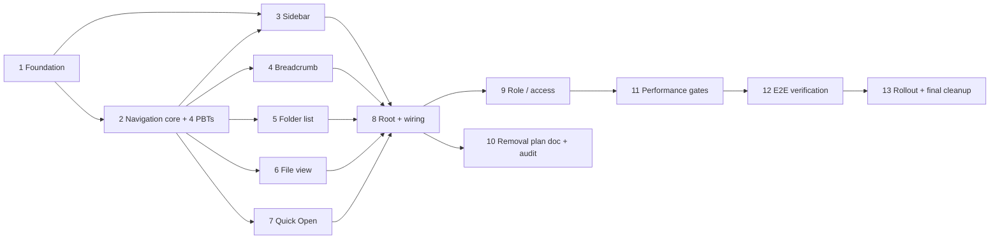

# Implementation Plan: Files Tab GitHub Redesign

## Overview

Convert the Files tab from a mini-IDE (`WorkspaceShell`) into a GitHub-style browse-first surface (`FilesTabRoot`) behind the `filesTabV3Enabled` feature flag. Coexist with the legacy implementation during rollout; delete legacy modules only after Phase 4 completes. Strictly preserve the public API of shared modules (`filesWorkspaceStore`, `src/app/actions/files/*`, `src/lib/db/schema.ts`) so the Tasks tab keeps working (Req 21.7–21.8).

Open-question decisions baked into these tasks:
- Q1 Multi-select → **drop**
- Q2 Edit semantics → **explicit Save + dirty indicator**
- Q3 Trash → **remove trash surface from Files tab**
- Q4 Drag-to-reorder → **keep**
- Q5 Context menu → **keep**
- Q6 Edit surface → **thinned CodeMirror** (no lint / no locks / no conflict resolution)
- Q7 `selectedNodeId` + `currentLocationId` → **coexist**

See design document sections:
- Component Tree, Data Flow, New Directory Layout
- Metadata Bug Fix (Req 17)
- URL Contract
- Removal Plan
- Startup Staging
- Correctness Properties (Properties 1–4)
- Migration and Rollout

## High-Level Task Graph



## Tasks

- [x] 1. Foundation (feature flag, devDeps, directory scaffold, store extensions, persist bump)
  - [x] 1.1 Add `filesTabV3Enabled` feature flag
    - Add `hardeningFilesV3` entry to `hardeningFeatureFlags` in `src/lib/features/hardening.ts` (default off)
    - Export `isFilesTabV3Enabled(userId?: string | null): boolean` from `src/lib/features/files.ts` (reads env `NEXT_PUBLIC_FILES_TAB_V3` + hardening domain gate)
    - Acceptance: unit test in `tests/unit/features/files-tab-v3-flag.test.ts` covering default-off, env override, and userId-hash gating
    - _Requirements: Req 21.1–21.8 (scope), design § Migration and Rollout / Feature Flag_

  - [x] 1.2 Add `fast-check` to devDependencies and register PBT runner pattern
    - `npm install --save-dev fast-check`
    - Add `tests/unit/files-tab/properties/` folder skeleton with `README.md` stating `numRuns ≥ 100` requirement
    - Acceptance: `import fc from "fast-check"` resolves under `tsx --test`; `npm run test:unit` picks up files in the new folder
    - _Requirements: design § Correctness Properties (fast-check library)_

  - [x] 1.3 Scaffold `src/components/projects/v2/files-tab/` directory tree
    - Create empty placeholder `.tsx` / `.ts` files matching design § New Directory Layout: `FilesTabRoot.tsx`, `FilesTabSidebar.tsx`, `FilesTabMain.tsx`, `breadcrumb/BreadcrumbBar.tsx`, `folder/{FolderListView,FolderListRow,FolderListHeader,FolderListStates}.tsx`, `file/{FileView,MetadataStrip,FileActionsBar,TextViewer}.tsx`, `quick-open/QuickOpenDialog.tsx`, `hooks/{useCurrentLocation,useNavigateTo,useFilesTabUrlSync,useDeepLinkResolver,useFilesTabStartupStage,useFolderContents}.ts`, `navigation.ts`, `url.ts`, `FilesTabRoleContext.tsx`
    - Each file exports a typed stub that compiles
    - Acceptance: `npm run typecheck` succeeds; `find src/components/projects/v2/files-tab -name "*.ts*" | wc -l` equals expected count
    - _Requirements: design § New Directory Layout_

  - [x] 1.4 Add `currentLocationId` + `setCurrentLocation` to workspace slice (coexist with `selectedNodeId`)
    - Edit `src/stores/files/workspaceSlice.ts` (or the equivalent file — audit with grep): add `currentLocationId: string | null` to `ProjectWorkspaceState`, default `null`
    - Add action `setCurrentLocation(projectId, nodeId)` that atomically (a) sets `currentLocationId`, (b) bumps `selectionVersion`, (c) ensures every ancestor of `nodeId` is in `expandedFolderIds`
    - DO NOT modify `selectedNodeId` or `selectedFolderId` (preserved for Tasks tab — Req 21.7)
    - Acceptance: unit test `tests/unit/stores/currentLocation.test.ts` verifies (i) default null, (ii) setCurrentLocation sets id and expands ancestors, (iii) `selectedNodeId` untouched when `setCurrentLocation` runs
    - _Requirements: Req 6.1, Req 21.7–21.8; design § Store Changes / ADDED_

  - [x] 1.5 Bump persist key `files-workspace-v2` → `files-workspace-v3` and update `partialize`
    - In the `persist` config for `filesWorkspaceStore`, bump `name` key
    - Update `partialize` to stop persisting: `splitEnabled`, `splitRatio`, `panes`, `pinnedByTabId`, `fileStates`, `activeFileSymbols`, `requestedScrollPosition`, `lastNodeEventsByNodeId`, `selectedNodeIds`, `savedViews`, `viewModeByExplorerMode`, `git.commitMessage`, `git.branches`, `git.syncInProgress`, `git.lastCommitSha`, `git.lastSyncAt`, `ui.bottomPanelTab`, `ui.bottomPanelHeight`, `ui.bottomPanelCollapsed`, `ui._prevBottomPanelCollapsed`, `ui.zenMode`, `ui.lastExecutionOutput`, `ui.lastExecutionSettingsHref`, `ui.stdinInputText`, `ui.problems`, `ui.commandHistory`, `ui.outputFilterMode`, `ui.searchReplaceOpen`, `ui.commandPaletteOpen`, `ui.sidebarWidth`, `prefs`
    - Persist: `currentLocationId`, `expandedFolderIds`, `favorites`, `recents`, `sort`, `foldersFirst`, `ui.sidebarCollapsed`, `ui.quickOpenOpen`
    - Acceptance: `tests/unit/stores/persist-migration.test.ts` seeds a legacy `files-workspace-v2` blob with dropped keys, mounts the store, and asserts (i) blob is ignored (fresh defaults), (ii) no dropped key is readable, (iii) `currentLocationId` roundtrips through persist
    - _Requirements: Req 15.19, Req 21.7; design § Migration Note_

- [x] 2. Navigation core: pure helpers + hooks + 4 property-based tests
  - [x] 2.1 Implement pure helpers `ancestorChain`, `encodePath`, `splitEncoded`
    - `src/components/projects/v2/files-tab/navigation.ts`:
      - `ancestorChain(nodesById, nodeId: string | null): ProjectNode[]` — returns root-to-node chain; returns `[]` when `nodeId` null or unresolved
    - `src/components/projects/v2/files-tab/url.ts`:
      - `encodePath(nodesById, nodeId: string | null): string` — empty string when null, otherwise `encodeURIComponent`-joined path segments (see design § URL Contract)
      - `splitEncoded(raw: string): string[]` — splits on `/`, decodes each segment, filters empty
    - Acceptance: unit test `tests/unit/files-tab/navigation-helpers.test.ts` covers root / intermediate / file / unresolved cases
    - _Requirements: Req 3.1–3.2, Req 10.1, Req 10.4, Req 20.1; design § URL Contract_

  - [x] 2.2 Implement `useCurrentLocation(projectId)`
    - File: `src/components/projects/v2/files-tab/hooks/useCurrentLocation.ts`
    - Returns `CurrentLocation | null` per design § Supporting Hooks
    - Pure selector over `currentLocationId` + `nodesById`; `{ type: "root" }` for null, `{ type: "folder" | "file", id, node }` otherwise
    - Acceptance: unit test covering all three branches plus the "store uninitialized" null return
    - _Requirements: Req 1.2, Req 1.3, Req 1.5, Req 6.1; design § useCurrentLocation_

  - [x] 2.3 Implement `useNavigateTo(projectId)` — the single write path
    - File: `src/components/projects/v2/files-tab/hooks/useNavigateTo.ts`
    - Returns stable callback that (a) calls `setCurrentLocation`, (b) expands every ancestor, (c) calls `addRecent(projectId, nodeId)` when `nodeId` resolves to a file
    - Acceptance: unit test verifying ancestor expansion + recent recording + callback stability across re-renders
    - _Requirements: Req 6.1–6.3, Req 8.4; design § useNavigateTo (only write path)_

  - [x] 2.4 Implement `useFilesTabUrlSync(projectId)` and `useDeepLinkResolver(projectId)`
    - Files: `src/components/projects/v2/files-tab/hooks/useFilesTabUrlSync.ts`, `src/components/projects/v2/files-tab/hooks/useDeepLinkResolver.ts`
    - `useFilesTabUrlSync`: subscribes to `currentLocationId`, writes `history.replaceState` with `?path=encodePath(...)`; listens for `popstate` and re-reads URL
    - `useDeepLinkResolver`: runs once on `stage === "main"`, reads `?path=`, validates non-empty + decoded length ≤ 4096, calls `findNodeByPathAny`, dispatches `navigateTo(resolved.id)` or inline-error on failure
    - Root state: no `?path=` parameter (not empty-value `?path=`)
    - Acceptance: unit test with jsdom URL mocks verifying (i) replaceState only, never pushState, (ii) root clears `?path=`, (iii) >4096-char deep link falls back to root + error, (iv) popstate triggers re-resolve
    - _Requirements: Req 10.1, Req 10.4–10.5, Req 19.8, Req 20.1, Req 20.3, Req 20.4; design § useFilesTabUrlSync / useDeepLinkResolver_

  - [x] 2.5 Implement `useFilesTabStartupStage(projectId)` with 5s per-stage timeout
    - File: `src/components/projects/v2/files-tab/hooks/useFilesTabStartupStage.ts`
    - Three stages: `"explorer" → "main" → "diagnostics"`
    - 5s timeout per stage auto-advances + emits non-blocking console warning + preserves prior-stage state
    - Acceptance: unit test with fake timers verifying stage progression, timeout auto-advance, and preservation of earlier state
    - _Requirements: Req 16.4, Req 16.6; design § Startup Staging_

  - [x] 2.6 Implement `useFolderContents(projectId, folderId)` wrapper
    - File: `src/components/projects/v2/files-tab/hooks/useFolderContents.ts`
    - Wraps `childrenByParentId` selector + `loadFolderContent` from `useExplorerBoot`
    - Returns `{ status: "loading" | "ready" | "error", children, retry }`
    - Acceptance: unit test covering all three statuses + retry side effect
    - _Requirements: Req 4.1, Req 4.9–4.10; design § FolderListView (uses this hook)_

  - [x] 2.7 Property test — `tree_breadcrumb_sync` (Property 1)
    - File: `tests/unit/files-tab/properties/tree-breadcrumb-sync.test.ts`
    - **Property 1: tree ⇄ breadcrumb sync**
    - **Validates: Req 3.1, 3.2, 6.1, 6.2, 6.3, 6.5, 2.8, 2.10, 4.7, 4.8**
    - Generators: `fc.letrec` project tree depth 1..6 fan-out 0..8 (names exclude `/` + control chars per Req 7.9); `fc.array` of navigation actions
    - Invariant: `breadcrumbSegments(currentLocationId).map(s=>s.id) === ancestorChain(nodesById, currentLocationId).map(n=>n.id)`
    - `fc.assert(..., { numRuns: 100 })`

  - [x] 2.8 Property test — `metadata_matches_selection` (Property 2)
    - File: `tests/unit/files-tab/properties/metadata-matches-selection.test.ts`
    - **Property 2: metadata matches selection**
    - **Validates: Req 17.1, 17.2, 17.3, 17.4, 5.1, 5.3, 5.4**
    - Render `FilesTabMain` via React Testing Library; after each generated navigation action, query `[data-testid="files-tab-metadata-strip"]` and assert either (a) absent when `currentLocation.type !== "file"`, or (b) `data-node-id === currentLocation.id`
    - `fc.assert(..., { numRuns: 100 })`

  - [x] 2.9 Property test — `url_state_roundtrip` (Property 3)
    - File: `tests/unit/files-tab/properties/url-state-roundtrip.test.ts`
    - **Property 3: URL ⇄ state roundtrip**
    - **Validates: Req 10.1, 10.4, 20.1**
    - Invariant: for every non-null id, `mockFindNodeByPathAny(projectId, splitEncoded(encodePath(nodesById, id))).id === id`; for null, `encodePath(nodesById, null) === ""` and root resolves when `?path=` absent
    - Use an in-memory mock of `findNodeByPathAny` that walks the generated tree
    - `fc.assert(..., { numRuns: 100 })`

  - [x] 2.10 Property test — `navigation_refresh_consistency` (Property 4)
    - File: `tests/unit/files-tab/properties/navigation-refresh-consistency.test.ts`
    - **Property 4: navigation refresh consistency**
    - **Validates: Req 20.2, 20.3, 10.4**
    - Apply navigation sequence → capture `window.location.search` → unmount + reset store → remount with pre-set `?path=` → wait for deep-link resolver → assert final `currentLocationId` equals pre-reload value
    - `fc.assert(..., { numRuns: 100 })`

- [x] 3. Sidebar (`FilesTabSidebar`, 280px, collapsible, inline search, reused tree renderer)
  - [x] 3.1 Implement `FilesTabSidebar.tsx`
    - File: `src/components/projects/v2/files-tab/FilesTabSidebar.tsx`
    - Props: `{ projectId, role, canEdit }`
    - Fixed width 280px when visible; 0px + no border when `ui.sidebarCollapsed === true`
    - 32px header row with collapse toggle (`PanelLeftClose` icon) + inline `<input type="text">` with 200ms debounce
    - Inline search: case-insensitive substring filter on node name with **ancestor retention** (every ancestor of a matching node remains visible) per Req 2.2
    - Tree body reuses existing virtualized renderer — preserved modules (do NOT fork):
      `ExplorerTree`, `FileTreeItem`, `FileTreeRow`, `useExplorerBoot`, `useExplorerDragDrop`, `useExplorerMutations`, `ExplorerContextMenu`, `ExplorerSearch`, `search.worker.ts`, `upload.worker.ts`, `explorerTypes.ts`, `FileIcons.tsx`
    - NO resize handle (Req 15.14); NO multi-select checkboxes (Q1 resolved drop); NO saved-views / outline / source-control / insights / command-palette toggles
    - Row click → `navigateTo(node.id)`
    - Acceptance: unit test `tests/unit/files-tab/sidebar.test.ts` verifying fixed width, collapse toggle, ancestor retention under search, absence of checkboxes + resize handle
    - _Requirements: Req 1.1, Req 1.7, Req 2.1–2.10, Req 15.14, Req 15.15–15.18; design § FilesTabSidebar, § Removal Plan / Priority 4_

  - [x] 3.2 Unit tests for sidebar search and collapse
    - File: `tests/unit/files-tab/sidebar-search.test.ts`
    - Cover: empty query shows full tree with current expand state, non-empty query filters with ancestor retention (Req 2.2), collapse toggle sets `ui.sidebarCollapsed`, expanded width always 280px
    - _Requirements: Req 2.1–2.7_

- [x] 4. Breadcrumb bar (`BreadcrumbBar`, 6-segment ellipsis truncation)
  - [x] 4.1 Implement `BreadcrumbBar.tsx`
    - File: `src/components/projects/v2/files-tab/breadcrumb/BreadcrumbBar.tsx`
    - Props: `{ projectId, location: CurrentLocation | null }`
    - Synchronous derivation via `ancestorChain` when ancestors cached; falls back to `getBreadcrumbs` server action only when ancestors missing (deep-link arrival)
    - Segments: root + intermediate folders = `<button>` (each calls `navigateTo(segment.id)`); file = bold `<span>`, non-clickable
    - Truncation: when `segments.length > 6` render `segments[0]` + ellipsis `<button>` + `segments.slice(-4)`. Ellipsis opens dropdown listing `segments.slice(1, -4)` (hidden segments)
    - Every clickable segment has `data-breadcrumb-segment-id={segment.id}` for PBT DOM queries
    - Acceptance: covered by Property 1 (Task 2.7) + unit tests in 4.2
    - _Requirements: Req 3.1–3.6; design § BreadcrumbBar_

  - [x] 4.2 Unit tests for breadcrumb rendering
    - File: `tests/unit/files-tab/breadcrumb-render.test.ts`
    - Cover: root-only, 2-segment folder, 5-segment folder (no truncation), 7-segment folder (truncation), file leaf bold+non-clickable, ellipsis dropdown lists correct hidden segments, click fires `navigateTo`
    - _Requirements: Req 3.1–3.6_

- [x] 5. Folder list view (`FolderListView`, 4-column GitHub-style)
  - [x] 5.1 Implement `FolderListView.tsx` + `FolderListRow.tsx` + `FolderListHeader.tsx` + `FolderListStates.tsx`
    - Files: `src/components/projects/v2/files-tab/folder/{FolderListView,FolderListRow,FolderListHeader,FolderListStates}.tsx`
    - Columns left-to-right: **Name, Last updated, Size, By** (Req 4.3). Widths: Name flex min-320px, Last updated 140px, Size 96px right-aligned, By 120px
    - Row height 40px
    - Sort: folders-first, then alphabetical case-insensitive with id-ascending tie-break (Req 4.2)
    - Row content: icon + name link + `VersionPill` when `currentVersion > 1` + favorite star + git change badge (M amber / A green / D red) gated on `filesFeatureFlags.wave4GitIntegration`
    - NO multi-select checkboxes (Q1 drop); drag-to-move preserved via existing `useExplorerDragDrop` (Q4 keep); context menu preserved via `ExplorerContextMenu` (Q5 keep)
    - Loading: header + spinner row; empty: header + "This folder is empty"; error: header + inline error + Retry button (Req 4.9–4.10)
    - `canEdit` toggles upload / create / rename / delete items in context menu and drop-target affordance
    - Row click → `navigateTo(row.id)`
    - _Requirements: Req 4.1–4.10, Req 7.1–7.2, Req 8.1–8.3, Req 11.1–11.4, Req 12.1–12.6; design § FolderListView_

  - [x] 5.2 Implement `formatBytes` and `formatRelativeTime` helpers
    - File: `src/components/projects/v2/files-tab/folder/format.ts`
    - `formatBytes(n)`: 1024-base, units B/KB/MB/GB/TB, one decimal; returns empty string for folders
    - `formatRelativeTime(iso)`: "{N} {unit} ago" where unit is largest-count ≥1 of seconds/minutes/hours/days/weeks/months/years; returns `—` when missing/null
    - _Requirements: Req 4.4, Req 4.5, Req 5.1_

  - [x] 5.3 Unit tests for `formatBytes` and `formatRelativeTime` threshold cases
    - File: `tests/unit/files-tab/format.test.ts`
    - `formatBytes`: 0, 1023, 1024, 1536, 1048576, 1073741824, 1099511627776
    - `formatRelativeTime`: now, 59s, 60s, 3599s, 3600s, 86399s, 86400s, missing, null; each asserts exact "N unit ago" string
    - _Requirements: Req 4.4, Req 4.5_

  - [x] 5.4 Unit tests for folder-list sort, empty, error, and git change badges
    - File: `tests/unit/files-tab/folder-list.test.ts`
    - Sort: folders first + alphabetical + id tie-break (includes fc-lite property suite)
    - States: loading spinner, empty indicator, error + Retry click re-invokes `loadFolderContent`
    - Git badges: M/A/D only when wave4 flag true; no badge when flag false; no badge when status absent (Req 12.5)
    - Version pill: hidden for `currentVersion <= 1`, visible exactly when `currentVersion > 1`
    - _Requirements: Req 4.2, Req 4.9, Req 4.10, Req 11.1–11.4, Req 12.1, Req 12.2, Req 12.5, Req 12.6_

- [x] 6. Single-file view (`FileView`, `MetadataStrip`, `FileActionsBar`, thinned editor, reused previews)
  - [x] 6.1 Implement `FileView.tsx` keyed by `currentLocation.id`
    - File: `src/components/projects/v2/files-tab/file/FileView.tsx`
    - Rendered from `FilesTabMain` with `<FileView key={location.id} ...>` so the subtree fully remounts on id change (Req 17 structural fix)
    - Picks preview: `AssetPreview` (image/video/audio/pdf/doc — reused unchanged from `src/components/projects/v2/preview/AssetPreview.tsx`) / `MarkdownPreview` (`.md`/`.markdown` — reused from `src/components/projects/v2/preview/MarkdownPreview.tsx`) / `TextViewer` / `BinaryFallback`
    - 0-byte image/video/audio → empty-media placeholder in place of preview (Req 5.6)
    - Preview load error → error indicator in preview region; MetadataStrip + Raw remain visible (Req 13.6)
    - _Requirements: Req 1.5, Req 1.6, Req 5.5–5.7, Req 13.1–13.6, Req 17.1–17.4; design § FileView_

  - [x] 6.2 Implement `MetadataStrip.tsx` with `data-testid` + `data-node-id`
    - File: `src/components/projects/v2/files-tab/file/MetadataStrip.tsx`
    - Root `<div data-testid="files-tab-metadata-strip" data-node-id={node.id}>`
    - Derives EVERY field from the `node` prop — no shared/parent state, no cross-render caches
    - Owns media side-effect hooks (`useImageDimensions`, `useMediaDuration`) so they cleanup on unmount
    - Fields: name, `formatBytes(size)`, `VersionPill` when `currentVersion > 1`, ISO-8601 timestamp, updater display name, MIME type. Any missing field → `—` (Req 5.9)
    - Dev-only `console.assert(node.id)`
    - `AssetMetadataPanel.tsx` is NOT used here (replaced structurally)
    - _Requirements: Req 5.1, Req 5.9, Req 11.3, Req 17.1–17.4; design § MetadataStrip_

  - [x] 6.3 Implement `FileActionsBar.tsx` with role-gated Edit
    - File: `src/components/projects/v2/files-tab/file/FileActionsBar.tsx`
    - Buttons: Raw, Edit (hidden entirely when `role === Role_Viewer`), Download
    - Read role from `FilesTabRoleContext`
    - _Requirements: Req 5.2–5.4, Req 19.3; design § FileActionsBar_

  - [x] 6.4 Implement `TextViewer.tsx` (Raw + thinned CodeMirror Edit, explicit Save, dirty indicator)
    - File: `src/components/projects/v2/files-tab/file/TextViewer.tsx`
    - Raw mode: plain text `<pre>`, no toolbars, no syntax highlighting, no line numbers (Req 5.2)
    - Edit mode: thinned CodeMirror setup — **no lint plugin, no conflict resolution, no lock acquisition** (Q6). Explicit `<button>Save</button>`. Dirty indicator wired into `MetadataStrip` (Q2)
    - Fetch-on-demand content; no per-tab dirty-buffer store
    - _Requirements: Req 5.2, Req 5.8, Req 15.4, Req 15.13; design § FileView / Open Question 6_

  - [x] 6.5 Unit tests for `MetadataStrip`, `FileActionsBar`, and 0-byte media placeholder
    - File: `tests/unit/files-tab/metadata-strip.test.ts`
    - Cover: all fields rendered; `—` fallback for each missing field (Req 5.9); VersionPill rendered iff `currentVersion > 1`; `data-node-id` equals `node.id`; Edit button absent for `Role_Viewer`; 0-byte image/video/audio renders placeholder instead of preview
    - _Requirements: Req 5.1, Req 5.3, Req 5.4, Req 5.6, Req 5.9, Req 11.3, Req 19.3_

- [x] 7. Quick Open (extract from `WorkspaceModalsHost`)
  - [x] 7.1 Extract and implement `QuickOpenDialog.tsx`
    - File: `src/components/projects/v2/files-tab/quick-open/QuickOpenDialog.tsx`
    - Extract the QuickOpen portion from `src/components/projects/v2/workspace/WorkspaceModalsHost.tsx` into this new component (then `WorkspaceModalsHost.tsx` is deleted in Task 10/13)
    - ⌘P / Ctrl+P toggles open **and** closes if open (Req 9.1); Escape closes + discards input, `currentLocation` unchanged (Req 9.7)
    - Empty query: up to 20 Recents (most-recent first); empty-state indicator when Recents empty (Req 9.2)
    - Non-empty query (1–256 chars): 200ms-debounced fuzzy rank by name+path, up to 50 results; no-results indicator when empty (Req 9.3)
    - ArrowDown/ArrowUp wrap + scroll focused into view (Req 9.4)
    - Enter / click → `navigateTo(file.id)` + close (Req 9.5)
    - Selected-node-gone → inline dialog error, dialog stays open, `currentLocation` unchanged (Req 9.6)
    - _Requirements: Req 9.1–9.7; design § QuickOpenDialog_

  - [x] 7.2 Unit tests for QuickOpen keyboard + error paths
    - File: `tests/unit/files-tab/quick-open.test.ts`
    - Cover each acceptance criterion of Req 9
    - _Requirements: Req 9.1–9.7_

- [x] 8. Root component + wiring behind feature flag
  - [x] 8.1 Implement `FilesTabRoot.tsx`
    - File: `src/components/projects/v2/files-tab/FilesTabRoot.tsx`
    - Props: `{ projectId, projectName?, currentUserId?, isOwnerOrMember, isActive?, syncStatus?, initialOpenPath? | null }` — drops `initialOpenLine` / `initialOpenColumn`
    - Calls `useFilesTabStartupStage`, gates `useDeepLinkResolver` on `stage === "main"`, wires `useFilesTabUrlSync`
    - Registers global `⌘P` / `Ctrl+P` handler (toggle QuickOpen) per Req 9.1
    - Wraps subtree in `FilesTabRoleContext.Provider`
    - Renders `FilesTabSidebar` + `FilesTabMain` + `QuickOpenDialog`
    - _Requirements: Req 1.1, Req 1.7, Req 6.1, Req 9.1, Req 10.1, Req 16.4; design § FilesTabRoot_

  - [x] 8.2 Implement `FilesTabMain.tsx` with dev-mode surface-disagreement assertion
    - File: `src/components/projects/v2/files-tab/FilesTabMain.tsx`
    - Conditional render: `currentLocation === null || type === "folder"` → `FolderListView`; `type === "file"` → `<FileView key={location.id} ...>`
    - Dev-only `useEffect` comparing `computeBreadcrumb(...).at(-1)?.id` vs tree highlight; `console.warn` on mismatch per Req 6.4
    - _Requirements: Req 1.2, Req 1.3, Req 1.5–1.8, Req 6.4, Req 17.1–17.4_

  - [x] 8.3 Gate `ProjectFilesWorkspace.tsx` on `filesTabV3Enabled`
    - Edit `src/components/projects/v2/ProjectFilesWorkspace.tsx` per design § Migration and Rollout / Coexistence: dynamic-import both `FilesTabRoot` and `WorkspaceShell`; branch on `isFilesTabV3Enabled(props.currentUserId)`
    - Implement `adaptToV3Props` that drops `initialOpenLine` / `initialOpenColumn` and passes `initialOpenPath` through
    - Acceptance: `tests/unit/files-tab/entry-gating.test.ts` renders with flag on/off and asserts the correct component subtree appears; `WorkspaceShell` is not loaded when flag on
    - _Requirements: Req 21.7–21.8; design § Coexistence_

  - [x] 8.4 Verify Tasks tab still works with unchanged store public API
    - Audit `src/components/projects/v2/TasksTab.tsx` + `src/components/projects/v2/FileTreePicker.tsx` consumers via `grep_search` for every method/key listed in design § Audit Note (upsertNodes, setChildren, toggleExpanded, addRecent, selectedNodeId, nodesById, childrenByParentId, taskLinkCounts, signedUrls, favorites, expandedFolderIds, etc.)
    - Write `tests/unit/stores/tasks-tab-public-api.test.ts` that imports each name and asserts they exist and keep their signature
    - _Requirements: Req 21.7, Req 21.8; design § Audit Note_

- [ ] 9. Role / access control
  - [x] 9.1 Implement `FilesTabRoleContext` and mutation gating
    - File: `src/components/projects/v2/files-tab/FilesTabRoleContext.tsx`
    - Derive `Role = Role_Owner | Role_Member | Role_Viewer` from `isOwnerOrMember` + authenticated-user state
    - `canEdit = role !== "Role_Viewer"`
    - Consumers: `FileActionsBar`, `FolderListRow`, `FilesTabSidebar` context-menu items (upload, create, rename, delete, move, Edit)
    - For `Role_Viewer`: mutation controls MUST NOT be visible, focusable, or activatable (Req 19.3); F2 / Delete keys are no-ops (Req 14.11–14.12)
    - _Requirements: Req 7.1–7.2, Req 14.11–14.12, Req 19.1–19.3_

  - [x] 9.2 Assert server-side rejection of Viewer mutations and deep-link arrival handling
    - Audit `src/app/actions/files/*` server actions to confirm they reject unauthorized callers with an authorization error (Req 19.6)
    - Add `tests/unit/files-tab/role-gate-viewer.test.ts`: (i) Viewer sees no mutation UI, (ii) programmatic dispatch of a mutation action returns authorization error, (iii) unauthenticated arrival via deep link redirects to sign-in without disclosing target name/path/content/metadata
    - Malformed + over-length deep link → Req 10.5 inline error; no target disclosure
    - _Requirements: Req 10.5, Req 19.3, Req 19.5–19.8_

- [x] 10. Removal plan documentation + audit (behind-flag coexistence — NO deletions yet)
  - [x] 10.1 Record removal plan inside `tasks.md` and add grep-audit tests
    - Add a `## Removal Plan Audit` section at the bottom of this file listing every file scheduled for deletion in Task 13, grouped by design § Removal Plan priority (1 Runner, 2 Bottom Panel, 3 Workspace Shell, 4 Explorer sub-features, 5 Store slice methods)
    - Create `tests/unit/files-tab/removal-audit.test.ts` that, for each to-be-deleted module path + every dropped store method name listed in design § Store Slice Methods, runs a `grep_search` via ripgrep shelling out from the test and asserts: either (a) the only remaining imports/uses are inside files scheduled for deletion, or (b) the reference is inside the legacy `WorkspaceShell` branch that is still gated behind the feature flag
    - The test emits a JSON report `artifacts/files-tab-removal-audit.json` consumed by Task 13
    - DO NOT delete any files yet — legacy path must keep working while the flag ramps
    - _Requirements: Req 15.1–15.19, Req 21.7–21.8; design § Removal Plan + § Audit Note_

- [x] 11. Performance gates + import-graph static assertion
  - [x] 11.1 Instrument sidebar-interactive and breadcrumb-interactive timings
    - Add `performance.mark("files-tab:sidebar-interactive")` at `FilesTabSidebar` first-paint and `performance.mark("files-tab:breadcrumb-interactive")` at `BreadcrumbBar` first-paint
    - Add `tests/unit/files-tab/performance-marks.test.ts` using a ≤1000-node fixture that asserts `sidebar-interactive ≤ 500ms` and `breadcrumb-interactive ≤ 750ms` from mount start (jsdom `performance.now()` stub); fail the build if exceeded
    - _Requirements: Req 16.5_

  - [x] 11.2 Wire 5s per-stage timeout warning surface
    - Confirm `useFilesTabStartupStage` emits non-blocking `console.warn` on timeout and preserves prior-stage state (already implemented in Task 2.5 — this task verifies integration with `FilesTabRoot`)
    - Add `tests/unit/files-tab/stage-timeout.test.ts` simulating a hung fetch that exceeds 5s and asserting auto-advance + warning + no state reset
    - _Requirements: Req 16.6_

  - [x] 11.3 Static import-graph test: forbidden modules unreachable from `FilesTabRoot`
    - File: `tests/unit/files-tab/forbidden-imports.test.ts`
    - Use TypeScript compiler API to walk the import graph starting at `src/components/projects/v2/files-tab/FilesTabRoot.tsx` and assert NO path reaches: any module under `src/lib/runner/`, `src/components/projects/v2/panels/BottomPanel.tsx` (and children `RunTab`, `OutputTab`, `ProblemsTab`, `RunnerStatusStrip`), `src/components/projects/v2/workspace/useLintOnEdit.ts`, `src/components/projects/v2/workspace/useCursorPresence.ts`, `src/components/projects/v2/workspace/cursorProtocol.ts`, `src/app/actions/parseStderrToProblems.ts`, `src/components/projects/v2/workspace/KeyboardShortcuts.tsx`, `src/components/projects/v2/explorer/OutlinePanel.tsx`, `src/components/projects/v2/explorer/SourceControlPanel.tsx`, `src/components/projects/v2/explorer/ExplorerInsightsHost.tsx`, `src/components/projects/v2/explorer/ExplorerCommandPalette.tsx`
    - _Requirements: Req 15.3, Req 15.4, Req 15.11–15.13, Req 15.15–15.17, Req 16.1–16.3, Req 21.5_

- [ ] 12. End-to-end verification (Req 18 audit record — Playwright)
  - [x] 12.1 E2E harness and audit record writer
    - Add `tests/e2e/files-tab/audit.ts` helper that appends `{ area, result: "pass" | "fail" | "not_applicable", timestamp, testerId, justification? }` entries to `tests/e2e/files-tab/audit-record.json`
    - Each E2E spec below calls `recordAudit(area, result, justification?)` exactly once
    - Release gate reads `audit-record.json`: failures block; `not_applicable` requires non-empty `justification`; any missing area blocks
    - _Requirements: Req 18.1–18.5_

  - [x] 12.2 E2E — `upload-file.spec.ts` (single file upload; drag-and-drop onto tree; drag-and-drop onto list row)
    - Areas: `single file upload`, `drag-and-drop upload onto Sidebar_Tree folders`, `drag-and-drop upload onto File_List folder rows`
    - _Requirements: Req 7.1, Req 7.3, Req 7.8, Req 18.1_

  - [x] 12.3 E2E — `upload-folder.spec.ts`
    - Area: `folder upload`
    - _Requirements: Req 7.1, Req 7.8, Req 18.1_

  - [x] 12.4 E2E — `rename.spec.ts` (inline F2 + dialog)
    - Areas: `inline rename`, `rename-via-dialog`
    - _Requirements: Req 7.4, Req 7.9, Req 14.8, Req 18.1_

  - [x] 12.5 E2E — `delete.spec.ts` (soft + permanent confirmation flow)
    - Areas: `soft delete`, `permanent delete`
    - _Requirements: Req 7.5, Req 14.9, Req 18.1_

  - [x] 12.6 E2E — `move.spec.ts` (into folder + reject circular)
    - Area: `move`
    - _Requirements: Req 7.6, Req 7.10, Req 18.1_

  - [x] 12.7 E2E — `favorites.spec.ts` (star/unstar + per-project persistence)
    - Area: `favorites toggle`
    - _Requirements: Req 8.1–8.3, Req 18.1_

  - [x] 12.8 E2E — `recents.spec.ts` (50-entry cap, LRU, localStorage key format)
    - Area: `Recents list correctness`
    - _Requirements: Req 8.4–8.6, Req 18.1_

  - [x] 12.9 E2E — `version-display.spec.ts` (pill in list + metadata strip)
    - Area: `version history display`
    - _Requirements: Req 11.1–11.4, Req 18.1_

  - [-] 12.10 E2E — `git-indicators.spec.ts` (M, A, D on a fixture repo)
    - Areas: `git Change_Indicator correctness for modified/added/deleted`
    - Uses a Git_Enabled_Project fixture; without fixture records `not_applicable` with justification
    - _Requirements: Req 12.1–12.6, Req 18.1, Req 18.3_

  - [x] 12.11 E2E — `breadcrumb-navigation.spec.ts` (root + intermediate + ellipsis)
    - Areas: `Breadcrumb_Bar navigation clicking root segment`, `Breadcrumb_Bar navigation clicking intermediate segments`
    - _Requirements: Req 3.4–3.6, Req 18.1_

  - [x] 12.12 E2E — `sidebar-tree.spec.ts` (mouse + keyboard expand/collapse + inline search)
    - Areas: `Sidebar_Tree mouse expand`, `Sidebar_Tree mouse collapse`, `Sidebar_Tree keyboard expand (ArrowRight)`, `Sidebar_Tree keyboard collapse (ArrowLeft)`, `Sidebar_Tree inline search`
    - _Requirements: Req 2.1–2.10, Req 14.1–14.10, Req 18.1_

  - [x] 12.13 E2E — `file-view-raw-edit.spec.ts` (Raw toggle, Edit toggle, Save)
    - Areas: `Single_File_View Raw toggle`, `Single_File_View Edit toggle`, `Single_File_View save`
    - Covers explicit Save + dirty indicator (Q2 decision)
    - _Requirements: Req 5.2, Req 5.8, Req 18.1_

  - [x] 12.14 E2E — `deep-link.spec.ts` (`?path=` resolution + malformed + over-length)
    - Area: `Deep_Link_Path resolution via ?path=`
    - _Requirements: Req 10.1–10.5, Req 19.8, Req 20.2, Req 20.4, Req 18.1_

  - [x] 12.15 E2E — `url-sync.spec.ts` (`history.replaceState` + back/forward)
    - Area: `URL synchronization via history.replaceState when Current_Location changes`
    - _Requirements: Req 10.4, Req 20.1, Req 20.3, Req 18.1_

  - [x] 12.16 E2E — `viewer-role.spec.ts` (Viewer + unauthenticated deep-link arrival)
    - Not an area from Req 18.1 list but required for Req 19 verification before release — record under optional audit area `viewer role deep-link arrival`
    - _Requirements: Req 19.3, Req 19.4, Req 19.5, Req 19.7_

  - [x] 12.17 Checkpoint — ensure all E2E areas are present in audit-record.json
    - Ensure all tests pass, ask the user if questions arise.

- [ ] 13. Rollout + final deletion sweep (ONLY after Phase 4 completes)
  - [ ] 13.1 Phase 1 — Internal rollout checklist
    - Flip `filesTabV3Enabled` on for engineering accounts; smoke-test sidebar, breadcrumb, folder list, file view, metadata, deep linking, quick-open
    - _Requirements: design § Rollout Strategy / Phase 1_

  - [ ] 13.2 Phase 2 — Canary 1%
    - Enable via hardening domain gate userId-hash; watch error rates + startup perf budget (Task 11.1) + user feedback
    - _Requirements: design § Rollout Strategy / Phase 2_

  - [ ] 13.3 Phase 3 — Ramp 10% → 50% → 100%
    - Widen over one week; use existing `isHardeningDomainEnabled`
    - _Requirements: design § Rollout Strategy / Phase 3_

  - [ ] 13.4 Phase 4 sweep — delete every legacy Files-tab module
    - Only run after (i) flag at 100% for one clean week, (ii) Task 12.17 audit-record complete with no unresolved fails, (iii) Task 10.1 removal-audit JSON is clean
    - **Delete (Priority 1 — Runner, Req 15.3, 16.1):** entire folder `src/lib/runner/` (`backend.ts`, `browser-sandbox.ts`, `contracts.ts`, `javascript.ts`, `local-analyzer.ts`, `prefs.ts`, `pyodide.ts`, `router.ts`, `runFile.ts`, `sql.ts`, `types.ts`, `typescript.ts`); `src/app/actions/parseStderrToProblems.ts`
    - **Delete (Priority 2 — Bottom Panel, Req 15.1–15.2, 16.2):** `src/components/projects/v2/panels/BottomPanel.tsx`, `RunTab.tsx`, `OutputTab.tsx`, `ProblemsTab.tsx`, `RunnerStatusStrip.tsx`, `ansiParser.ts`
    - **Delete (Priority 3 — Workspace Shell):** from `src/components/projects/v2/workspace/`: `useCursorPresence.ts`, `cursorProtocol.ts`, `useLintOnEdit.ts`, `useWorkspaceLayoutState.ts`, `WorkspaceTabManager.ts`, `WorkspacePaneHost.tsx`, `WorkspaceBottomPanelHost.tsx`, `KeyboardShortcuts.tsx`, `WorkspaceGitToolbar.tsx`, `WorkspaceSearchReplace.tsx`, `WorkspaceKeyboard.ts`, `WorkspaceLockManager.ts`, `WorkspaceAutoSave.ts`, `useWorkspaceLifecycle.ts`, `useWorkspaceUiState.ts`, `useWorkspacePane.ts`, `EditorPane.tsx`, `StatusBar.tsx`, `WorkspaceSyncOverlay.tsx`, `WorkspaceShell.tsx`, `indexQueueRuntime.ts`, `WorkspaceModalsHost.tsx`, entire `tab-manager/` subdirectory
    - **Delete (Priority 4 — Explorer sub-features, Req 15.15–15.18):** from `src/components/projects/v2/explorer/`: `OutlinePanel.tsx`, `SourceControlPanel.tsx`, `ExplorerInsightsHost.tsx`, `ExplorerCommandPalette.tsx`, `ExplorerBatchOps.tsx` (Q1 drop), `MultiFileDiffDialog.tsx`; simplify `ExplorerDialogsHost.tsx` (drop saved-views UI, keep create/rename/delete/move); simplify `ExplorerToolbarHost.tsx` (drop saved-views, outline, source-control, insights toggles); replace `ExplorerShell.tsx` with `FilesTabSidebar.tsx`
    - **Preserve (referenced by `FilesTabSidebar`):** `ExplorerTree.tsx`, `FileTreeItem.tsx`, `FileTreeRow.tsx`, `useExplorerBoot.ts`, `useExplorerDragDrop.ts`, `useExplorerMutations.ts`, `explorerTypes.ts`, `FileIcons.tsx`, `ExplorerContextMenu.tsx`, `ExplorerSearch.tsx`, `search.worker.ts`, `upload.worker.ts`
    - Delete `AssetMetadataPanel.tsx` (replaced by `MetadataStrip`)
    - After each delete run `npm run typecheck && npm run lint`
    - _Requirements: Req 15.1–15.18, Req 16.1–16.3; design § Removal Plan_

  - [ ] 13.5 Drop legacy store slice methods
    - `workspaceSlice.ts`: remove `setSplitEnabled`, `setSplitRatio`, `pinTab`, `closeOtherTabs`, `closeTabsToRight`, `openTab`, `closeTab`, `setActiveTab`, `reorderTabs`, `moveTabToPane`, `pruneGhostTabs`
    - `uiSlice.ts`: remove `toggleBottomPanel`, `setBottomPanelTab`, `setBottomPanelHeight`, `setLastExecutionOutput`, `setLastExecutionSettingsHref`, `setStdinInputText`, `setProblems`, `clearProblems`, `applyQuickFix`, `pushCommandToHistory`, `setSidebarWidth`, `toggleZenMode`, `setSearchReplaceOpen`, `setCommandPaletteOpen`, `setOutputFilterMode`
    - `explorerSlice.ts`: remove `saveCurrentView`, `applySavedView`, `deleteSavedView`
    - `editorSlice.ts`: remove `setFileState`, `setActiveFileSymbols`, `requestScrollTo`, `clearScrollRequest` (delete slice entirely if no external consumer)
    - `locksSlice.ts`: drop `setLock`, `clearLock` writes; keep read-only selectors
    - `gitSlice.ts`: drop `setGitSyncStatus`, `setGitCommitMessage`, `setGitBranches`, `setGitLastSync`, `clearGitState`; keep `setGitRepo`, `setGitChangedFiles`, `setGitStatusLoaded`
    - For each name, re-run grep-audit from Task 10.1 to confirm zero non-deleted consumers remain
    - `npm run typecheck && npm run lint`
    - _Requirements: Req 15.7, Req 15.11, Req 15.14, Req 15.18, Req 21.7–21.8_

  - [ ] 13.6 Delete the `filesTabV3Enabled` feature flag
    - Remove `hardeningFilesV3` entry from `hardeningFeatureFlags` in `src/lib/features/hardening.ts`
    - Remove `isFilesTabV3Enabled` from `src/lib/features/files.ts`
    - Simplify `ProjectFilesWorkspace.tsx` to always render `FilesTabRoot` (drop dynamic branch + `adaptToV3Props` merged inline)
    - Delete the flag test from Task 1.1
    - `npm run typecheck && npm run lint`
    - _Requirements: design § Rollout Strategy / Phase 4_

  - [ ] 13.7 Final checkpoint — full suite passes
    - Ensure all tests pass, ask the user if questions arise.

## Notes

- Tasks marked with `*` are optional supplementary tests that MVP can skip. The 4 PBTs (Tasks 2.7–2.10) and the E2E suite (Task 12) are NOT optional — they are mandated by design § Correctness Properties and Req 18 respectively.
- Every task references specific requirement clauses for traceability.
- Checkpoints (Task 12.17 and Task 13.7) enforce incremental validation.
- Deletions (Task 13.4 / 13.5 / 13.6) run only after the flag is at 100% and Task 10.1's audit is clean.
- Shared modules (`filesWorkspaceStore` public API, `src/app/actions/files/*`, `src/lib/db/schema.ts`) must retain their observable behavior for the Tasks tab throughout (Req 21.7–21.8).

## Removal Plan Audit

Cross-reference for Task 10.1 — files + store methods scheduled for deletion in Task 13. Each line must resolve to zero references outside the legacy `WorkspaceShell` subtree when the flag is ramped to 100%.

**Priority 1 — Runner (Req 15.3, 16.1):**
- `src/lib/runner/{backend,browser-sandbox,contracts,javascript,local-analyzer,prefs,pyodide,router,runFile,sql,types,typescript}.ts`
- `src/app/actions/parseStderrToProblems.ts`

**Priority 2 — Bottom Panel (Req 15.1–15.2, 16.2):**
- `src/components/projects/v2/panels/{BottomPanel,RunTab,OutputTab,ProblemsTab,RunnerStatusStrip}.tsx`
- `src/components/projects/v2/panels/ansiParser.ts`

**Priority 3 — Workspace Shell (Req 15.4, 15.8–15.13, 16.2–16.3, 21.5):**
- `src/components/projects/v2/workspace/{useCursorPresence,cursorProtocol,useLintOnEdit,useWorkspaceLayoutState,WorkspaceTabManager,WorkspacePaneHost,WorkspaceBottomPanelHost,KeyboardShortcuts,WorkspaceGitToolbar,WorkspaceSearchReplace,WorkspaceKeyboard,WorkspaceLockManager,WorkspaceAutoSave,useWorkspaceLifecycle,useWorkspaceUiState,useWorkspacePane,EditorPane,StatusBar,WorkspaceSyncOverlay,WorkspaceShell,indexQueueRuntime,WorkspaceModalsHost}.{ts,tsx}`
- `src/components/projects/v2/workspace/tab-manager/` (entire directory)

**Priority 4 — Explorer sub-features (Req 15.15–15.18, 12.3):**
- `src/components/projects/v2/explorer/{OutlinePanel,SourceControlPanel,ExplorerInsightsHost,ExplorerCommandPalette,ExplorerBatchOps,MultiFileDiffDialog,ExplorerShell}.tsx`
- `src/components/projects/v2/preview/AssetMetadataPanel.tsx` (replaced structurally by `MetadataStrip`)

**Priority 5 — Store slice method drops (Req 15.7, 15.11, 15.14, 15.18):**
- `workspaceSlice`: `setSplitEnabled`, `setSplitRatio`, `pinTab`, `closeOtherTabs`, `closeTabsToRight`, `openTab`, `closeTab`, `setActiveTab`, `reorderTabs`, `moveTabToPane`, `pruneGhostTabs`
- `uiSlice`: `toggleBottomPanel`, `setBottomPanelTab`, `setBottomPanelHeight`, `setLastExecutionOutput`, `setLastExecutionSettingsHref`, `setStdinInputText`, `setProblems`, `clearProblems`, `applyQuickFix`, `pushCommandToHistory`, `setSidebarWidth`, `toggleZenMode`, `setSearchReplaceOpen`, `setCommandPaletteOpen`, `setOutputFilterMode`
- `explorerSlice`: `saveCurrentView`, `applySavedView`, `deleteSavedView`
- `editorSlice`: `setFileState`, `setActiveFileSymbols`, `requestScrollTo`, `clearScrollRequest`
- `locksSlice`: `setLock`, `clearLock` (writes only)
- `gitSlice`: `setGitSyncStatus`, `setGitCommitMessage`, `setGitBranches`, `setGitLastSync`, `clearGitState`

**Preserve (public API per Req 21.7–21.8):**
- `upsertNodes`, `setChildren`, `setFolderPayload`, `setNodesAndChildren`, `markChildrenLoaded`, `setFolderMeta`, `removeNodeFromCaches`, `setTaskLinkCounts`, `setNodes`, `hydrateFromIdb`
- `toggleExpanded`, `setExplorerMode`, `setViewMode`, `setSelectedNode`, `setSelectedNodeIds`, `setSearchQuery`, `setSort`, `setFoldersFirst`, `addRecent`, `toggleFavorite`
- State keys: `nodesById`, `childrenByParentId`, `loadedChildren`, `folderMeta`, `taskLinkCounts`, `signedUrls`, `expandedFolderIds`, `favorites`, `recents`, `selectedNodeId`, `selectedFolderId`, `currentLocationId` (new)

## Task Dependency Graph

```json
{
  "waves": [
    { "id": 0, "tasks": ["1.1", "1.2", "1.3"] },
    { "id": 1, "tasks": ["1.4", "1.5"] },
    { "id": 2, "tasks": ["2.1", "2.2", "2.5", "2.6"] },
    { "id": 3, "tasks": ["2.3", "2.4"] },
    { "id": 4, "tasks": ["3.1", "4.1", "5.2", "6.2", "6.3", "7.1", "9.1"] },
    { "id": 5, "tasks": ["5.1", "6.4", "9.2"] },
    { "id": 6, "tasks": ["6.1"] },
    { "id": 7, "tasks": ["8.1", "8.2"] },
    { "id": 8, "tasks": ["8.3", "8.4"] },
    { "id": 9, "tasks": ["2.7", "2.8", "2.9", "2.10", "3.2", "4.2", "5.3", "5.4", "6.5", "7.2", "10.1", "11.1", "11.2", "11.3"] },
    { "id": 10, "tasks": ["12.1"] },
    { "id": 11, "tasks": ["12.2", "12.3", "12.4", "12.5", "12.6", "12.7", "12.8", "12.9", "12.10", "12.11", "12.12", "12.13", "12.14", "12.15", "12.16"] },
    { "id": 12, "tasks": ["13.1"] },
    { "id": 13, "tasks": ["13.2"] },
    { "id": 14, "tasks": ["13.3"] },
    { "id": 15, "tasks": ["13.4"] },
    { "id": 16, "tasks": ["13.5"] },
    { "id": 17, "tasks": ["13.6"] }
  ]
}
```
