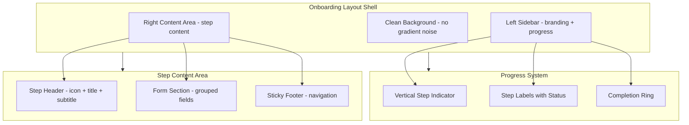
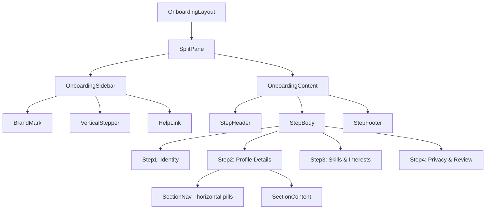
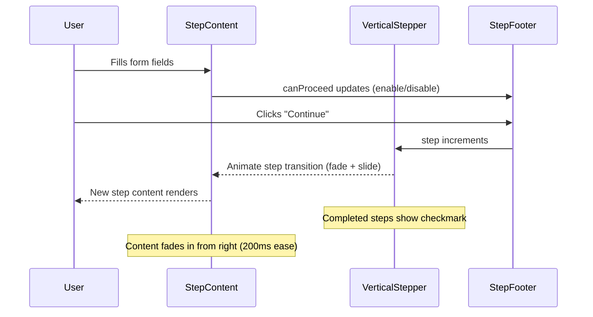

# Design Document: Onboarding UI Redesign

## Overview

A comprehensive visual redesign of the 4-step onboarding flow, inspired by LinkedIn and GitHub's clean, professional aesthetics. The redesign targets reduced visual noise, improved information hierarchy, consistent spacing, and a polished feel across all phases — without modifying any logic, validation, state management, or backend behavior.

The current implementation uses a single `Card` per step with inconsistent spacing, dense form layouts, and a generic gradient background. The redesign introduces a structured layout system with a persistent sidebar for context, refined typography scale, purposeful whitespace, and interaction states that communicate progress and confidence.

## Architecture



## Component Hierarchy




## Sequence Diagram: Step Navigation Flow



## Design System: Onboarding Tokens

### Spacing Scale

| Token | Value | Usage |
|-------|-------|-------|
| `--onb-space-xs` | 4px | Inline icon gaps |
| `--onb-space-sm` | 8px | Between related elements |
| `--onb-space-md` | 16px | Between form fields |
| `--onb-space-lg` | 24px | Between form groups/sections |
| `--onb-space-xl` | 32px | Step header to content |
| `--onb-space-2xl` | 48px | Major section breaks |

### Typography Scale

| Element | Size | Weight | Line Height | Color |
|---------|------|--------|-------------|-------|
| Step title | 24px (1.5rem) | 600 | 1.3 | `foreground` |
| Step subtitle | 14px (0.875rem) | 400 | 1.5 | `muted-foreground` |
| Section heading | 16px (1rem) | 500 | 1.4 | `foreground` |
| Field label | 14px (0.875rem) | 500 | 1.4 | `foreground` |
| Field hint | 12px (0.75rem) | 400 | 1.5 | `muted-foreground` |
| Chip/tag text | 13px (0.8125rem) | 450 | 1 | varies |
| Button text | 14px (0.875rem) | 500 | 1 | `primary-foreground` |

### Color Palette (Onboarding-Specific)

Uses existing design system tokens. No new colors introduced — only purposeful application:

| Surface | Light | Dark | Usage |
|---------|-------|------|-------|
| Page background | `background` (white) | `background` (dark) | Clean, flat — no gradient |
| Sidebar | `muted` (neutral-50) | `card` (neutral-800) | Subtle differentiation |
| Content card | `card` (white) | `card` (neutral-800) | Elevated content area |
| Selected chip | `primary/10` bg + `primary` border | Same with dark primary | Active selections |
| Unselected chip | `background` + `border` | Same | Dormant options |
| Progress complete | `primary` | `primary` | Completed step indicator |
| Progress current | `primary/20` ring | `primary/20` ring | Active step pulse |
| Progress pending | `muted` | `muted` | Future steps |

### Border Radius

| Element | Radius |
|---------|--------|
| Content card | `--radius-xl` (14px) |
| Input fields | `--radius-md` (8px) |
| Chips/tags | `9999px` (full round) |
| Avatar | `9999px` (circle) |
| Section nav pills | `--radius-lg` (10px) |
| Radio cards | `--radius-lg` (10px) |

### Shadows

| Element | Shadow |
|---------|--------|
| Content card | `0 1px 3px rgba(0,0,0,0.04), 0 4px 12px rgba(0,0,0,0.03)` |
| Sidebar | none (border separation only) |
| Hover on radio card | `0 2px 8px rgba(0,0,0,0.06)` |
| Focus ring | `0 0 0 2px var(--ring)` (existing) |


## Components and Interfaces

### Component: OnboardingLayout (Shell)

**Purpose**: Replaces the current full-page gradient with a split-pane layout. On desktop: left sidebar (280px) + right content. On mobile: stacked with a compact top progress bar.

```typescript
interface OnboardingLayoutProps {
  currentStep: number
  totalSteps: number
  children: React.ReactNode
}
```

**Visual Spec**:
- Desktop (≥768px): Two-column split. Sidebar fixed left, content scrollable right.
- Mobile (<768px): Single column. Sidebar collapses to a slim horizontal progress bar at top.
- Background: flat `background` color. No gradient. Clean and quiet.
- Sidebar background: `muted` with a subtle right border (`border`).
- Content area: centered, max-width 560px, generous vertical padding (48px top, 32px bottom).

**Design Rationale**: LinkedIn uses a clean split layout for onboarding. GitHub keeps it centered and minimal. The split gives persistent context (progress) without cluttering the form area.

---

### Component: OnboardingSidebar

**Purpose**: Persistent left rail showing brand, progress, and optional help link.

```typescript
interface OnboardingSidebarProps {
  currentStep: number
  totalSteps: number
  stepLabels: Array<{ title: string; subtitle: string }>
  completedSteps: Set<number>
}
```

**Visual Spec**:
- Width: 280px fixed
- Top: Brand logo/mark (small, 24px height) + app name in `foreground` at 500 weight
- Middle: Vertical stepper with numbered circles (24px diameter)
  - Completed: filled `primary` circle with white checkmark icon (12px)
  - Current: `primary/20` ring with `primary` filled inner dot (8px), subtle pulse animation
  - Pending: `muted` circle with `muted-foreground` number
  - Connecting lines: 2px wide, `primary` for completed segments, `border` for pending
  - Each step shows title (14px, 500 weight) and subtitle (12px, `muted-foreground`)
- Bottom: "Need help?" link in `muted-foreground`, 12px

**Inspiration**: GitHub's vertical stepper in repository setup. LinkedIn's progress sidebar in profile completion.

---

### Component: StepHeader

**Purpose**: Consistent header for each step. Replaces the current Card header with icon circle.

```typescript
interface StepHeaderProps {
  title: string
  subtitle: string
  icon?: React.ReactNode // Optional — only if it adds meaning
}
```

**Visual Spec**:
- No icon circle. The current colored circles add noise without information.
- Title: 24px, weight 600, `foreground`. Left-aligned (not centered).
- Subtitle: 14px, weight 400, `muted-foreground`. 4px below title.
- Bottom margin: 32px before form content begins.
- Left-aligned text (not centered) — matches LinkedIn/GitHub reading patterns.

**Design Rationale**: Removing the decorative icon circles reduces noise. Left-alignment is faster to scan than centered text for form contexts.

---

### Component: StepFooter

**Purpose**: Navigation buttons pinned to bottom of content area.

```typescript
interface StepFooterProps {
  step: number
  totalSteps: number
  canProceed: boolean
  isLoading: boolean
  onBack: () => void
  onNext: () => void
  onSubmit: () => void
}
```

**Visual Spec**:
- Sticky to bottom of content viewport (not fixed to screen — scrolls with content on short pages)
- Flex row, `justify-between`
- Back button: ghost variant, `muted-foreground`, no icon (text only: "Back")
- Continue button: solid `primary`, white text, 14px weight 500, height 40px, min-width 120px
- Final step: "Complete setup" with subtle gradient background (`app-accent-gradient`)
- Disabled state: 50% opacity, no pointer events
- Loading state: spinner replaces text, button width preserved (no layout shift)
- Spacing: 24px top padding, separated from form content by a subtle `border` line

---

### Component: ChipSelector (Reusable)

**Purpose**: Unified chip/tag selection component used for skills, interests, open-to, gender, etc.

```typescript
interface ChipSelectorProps {
  options: Array<{ value: string; label: string }>
  selected: Set<string>
  onToggle: (value: string) => void
  variant: 'single' | 'multi'
  size?: 'sm' | 'md'
}
```

**Visual Spec**:
- Unselected: `background` fill, 1px `border` stroke, `foreground` text at 13px
- Selected: `primary/8` fill, 1.5px `primary` stroke, `primary` text, checkmark icon (12px) before label
- Hover (unselected): `muted` fill, border darkens slightly
- Transition: background 150ms ease, border-color 150ms ease
- Padding: 6px 14px (sm), 8px 16px (md)
- Gap between chips: 8px
- Border radius: full round (9999px)
- No shadow on chips — flat and clean

**Design Rationale**: Current chips use `bg-primary text-primary-foreground` when selected which is too heavy. A tinted background with colored border is more refined (GitHub label style).

---

### Component: RadioCardGroup

**Purpose**: Selection cards for availability, visibility, message privacy.

```typescript
interface RadioCardGroupProps {
  options: Array<{ value: string; label: string; description: string }>
  selected: string
  onChange: (value: string) => void
  columns?: 1 | 2
}
```

**Visual Spec**:
- Unselected: `card` background, 1px `border`, `--radius-lg` corners
- Selected: `card` background, 2px `primary` border, subtle `primary/5` background tint
- Hover (unselected): border transitions to `primary/40`
- Selected indicator: small filled circle (16px) with inner dot, right-aligned (not a checkmark in a circle)
- Label: 14px, weight 500, `foreground`
- Description: 13px, weight 400, `muted-foreground`
- Padding: 14px 16px
- Gap between cards: 10px
- Transition: border-color 150ms, background 150ms
- No heavy shadow on hover — just border change

**Design Rationale**: Current implementation uses `border-2` which is too thick for unselected state. The 1px → 2px transition on selection provides clear feedback without visual weight on dormant options.


## Per-Phase Visual Specifications

### Phase 1: Welcome & Identity (Step 1)

**Current Problems**:
- Centered layout with decorative icon circle wastes vertical space
- "Welcome, [Name]! 👋" with emoji feels informal/noisy
- Avatar is too prominent for a step focused on username selection
- Pre-fill confirmation text ("✓ Pre-filled from your account") uses green which conflicts with validation green

**Redesigned Layout**:

```
┌─────────────────────────────────────────────┐
│                                             │
│  Let's set up your profile                  │  ← 24px, weight 600
│  Choose a username and confirm your name    │  ← 14px, muted
│                                             │
│  ┌─────────────────────────────────────┐    │
│  │  [Avatar 64px]  Change photo        │    │  ← Inline row, not stacked
│  └─────────────────────────────────────┘    │
│                                             │
│  Full name *                                │
│  ┌─────────────────────────────────────┐    │
│  │ John Doe                            │    │  ← 40px height, --radius-md
│  └─────────────────────────────────────┘    │
│  Pre-filled from your account               │  ← 12px, muted-foreground (no icon)
│                                             │
│  Username *                                 │
│  ┌─────────────────────────────────────┐    │
│  │ @ johndoe                           │    │  ← With inline prefix indicator
│  └─────────────────────────────────────┘    │
│  ✓ Available                                │  ← Green only for valid state
│                                             │
└─────────────────────────────────────────────┘
```

**Key Changes**:
- Avatar moved to a compact inline row (64px, not 96px) — it's not the focus of this step
- No emoji in headings
- Left-aligned everything
- Pre-fill hint uses neutral `muted-foreground` (not green)
- Username field gets an `@` prefix indicator inside the input (like GitHub)
- Reduced avatar ring from 4px to 2px, color `border` not `primary/10`

---

### Phase 2: Profile Details (Step 2)

**Current Problems**:
- Sticky section nav with completion badges + tabs is visually heavy (double navigation)
- The "done" badges (green pills) compete with the tab navigation below them
- Sections feel cramped — too many fields visible at once
- Select dropdowns look like native HTML (no custom styling)

**Redesigned Layout**:

**Section Navigation** (replaces sticky tabs + badges):

```
┌─────────────────────────────────────────────┐
│                                             │
│  Tell us about yourself                     │
│  This helps us personalize your experience  │
│                                             │
│  ┌──────┐ ┌──────────┐ ┌───────┐ ┌──────┐  │
│  │●Ident│ │ Work     │ │Profile│ │Social│  │  ← Horizontal pill nav
│  └──────┘ └──────────┘ └───────┘ └──────┘  │
│                                             │
│  ─ ─ ─ ─ ─ ─ ─ ─ ─ ─ ─ ─ ─ ─ ─ ─ ─ ─ ─  │  ← Subtle divider
│                                             │
│  [Section content below]                    │
│                                             │
└─────────────────────────────────────────────┘
```

**Section Nav Spec**:
- Single row of pills (not tabs + badges separately)
- Active pill: `primary/10` background, `primary` text, weight 500
- Completed pill: small dot indicator (4px `primary` circle) before label
- Inactive pill: `transparent` background, `muted-foreground` text
- Pill padding: 8px 14px, gap 6px, border-radius `--radius-lg`
- No sticky positioning — scrolls with content (reduces visual layers)
- Remove the separate completion badge row entirely

**Section: Identity**

```
┌─────────────────────────────────────────────┐
│  Gender (optional)                          │
│                                             │
│  [Male] [Female] [Non-binary] [Other]       │  ← ChipSelector, single mode
│  [Prefer not to say]                        │
│                                             │
│  Pronouns (optional)                        │
│  ┌─────────────────────────────────────┐    │
│  │ e.g. they/them                      │    │
│  └─────────────────────────────────────┘    │
│                                             │
│  You can always change these in settings    │  ← 12px hint, no "Skip" button
│                                             │
└─────────────────────────────────────────────┘
```

- Remove the "Skip for now" button — the fields are already optional, the hint communicates this
- Chip selector uses the refined style (tinted bg, not solid fill)
- 24px gap between gender and pronouns sections

**Section: Work Preferences**

```
┌─────────────────────────────────────────────┐
│  Experience level                           │
│  ┌─────────────────────────────────────┐    │
│  │ Select level              ▾         │    │  ← Custom select (shadcn Select)
│  └─────────────────────────────────────┘    │
│                                             │
│  Weekly availability                        │
│  ┌─────────────────────────────────────┐    │
│  │ Select hours              ▾         │    │
│  └─────────────────────────────────────┘    │
│                                             │
│  ── 16px gap ──                             │
│                                             │
│  Open to                                    │
│  [Full-time roles] [Part-time] [Freelance]  │  ← ChipSelector, multi mode
│  [Open source] [Mentorship] [Hackathons]    │
│  [Co-founder opportunities]                 │
│                                             │
│  ┌──────────────────────────────┐ [Add]     │  ← Custom input, compact
│  │ Add your own (max 32)       │           │
│  └──────────────────────────────┘           │
│                                             │
│  ── 16px gap ──                             │
│                                             │
│  Current availability                       │
│  ┌─────────────────────────────────────┐    │
│  │ ○ Available                         │    │  ← RadioCardGroup
│  │   Open for new opportunities        │    │
│  ├─────────────────────────────────────┤    │
│  │ ○ Busy                              │    │
│  │   Limited availability right now    │    │
│  ├─────────────────────────────────────┤    │
│  │ ○ Focusing                          │    │
│  │   Heads-down on current work        │    │
│  ├─────────────────────────────────────┤    │
│  │ ○ Offline                           │    │
│  │   Not actively looking              │    │
│  └─────────────────────────────────────┘    │
│                                             │
└─────────────────────────────────────────────┘
```

- Replace native `<select>` with shadcn `Select` component for consistent styling
- Two selects side-by-side on desktop (grid 2-col), stacked on mobile
- RadioCardGroup for availability — single column, no grid
- Remove the `Clock3` icon from the "Current availability" heading — unnecessary decoration

**Section: Profile**

```
┌─────────────────────────────────────────────┐
│  Headline                                   │
│  ┌─────────────────────────────────────┐    │
│  │ Full Stack Developer | OSS          │    │
│  └─────────────────────────────────────┘    │
│  A short tagline for your profile           │
│                                             │
│  Bio                                        │
│  ┌─────────────────────────────────────┐    │
│  │                                     │    │  ← textarea, 100px min-height
│  │                                     │    │
│  └─────────────────────────────────────┘    │
│                                    234/500   │  ← Right-aligned counter
│                                             │
│  Location              Website              │  ← 2-col grid
│  ┌────────────────┐   ┌────────────────┐    │
│  │ 📍 City, ST   │   │ 🌐 https://   │    │
│  └────────────────┘   └────────────────┘    │
│  [Use my location]                          │  ← Text button, no icon prefix
│                                             │
└─────────────────────────────────────────────┘
```

- Input icons (MapPin, Globe) stay as left-padding indicators — they add useful context
- "Use my location" as a small text link below the input (not beside the label)
- Bio textarea: reduce min-height from 120px to 100px, cleaner proportion
- Character counter: only show when bio has content (hide at 0)

**Section: Social Links**

```
┌─────────────────────────────────────────────┐
│  Social links (optional)                    │
│  Help others find you across platforms      │
│                                             │
│  GitHub                                     │
│  ┌─────────────────────────────────────┐    │
│  │ github.com/                         │    │  ← Prefix as placeholder hint
│  └─────────────────────────────────────┘    │
│                                             │
│  LinkedIn                                   │
│  ┌─────────────────────────────────────┐    │
│  │ linkedin.com/in/                    │    │
│  └─────────────────────────────────────┘    │
│                                             │
│  X (Twitter)                                │
│  ┌─────────────────────────────────────┐    │
│  │ x.com/                              │    │
│  └─────────────────────────────────────┘    │
│                                             │
│  Portfolio                                  │
│  ┌─────────────────────────────────────┐    │
│  │ https://                            │    │
│  └─────────────────────────────────────┘    │
│                                             │
└─────────────────────────────────────────────┘
```

- Single column layout (not 2-col grid) — social URLs are long, need full width
- Remove the `Users` icon from the section header
- Placeholder text shows the expected URL prefix pattern
- Remove the "Example: adding GitHub improves..." hint — too instructional/noisy

---

### Phase 3: Skills & Interests (Step 3)

**Current Problems**:
- Both skills and interests use identical chip styling — no visual differentiation
- "Select at least one skill" instruction is redundant with the `*` indicator
- Large chip grid with 20 options feels overwhelming

**Redesigned Layout**:

```
┌─────────────────────────────────────────────┐
│                                             │
│  What are you good at?                      │  ← Conversational, not "Skills & Interests"
│  Pick skills and topics that describe you   │
│                                             │
│  Skills *                                   │
│  ┌─────────────────────────────────────┐    │
│  │ [React] [Next.js] [TypeScript]      │    │
│  │ [JavaScript] [Python] [Node.js]     │    │  ← First 2 rows visible
│  │ [GraphQL] [PostgreSQL] [MongoDB]    │    │
│  │ [AWS] [Docker] [Kubernetes]         │    │
│  │                                     │    │
│  │ ▾ Show more (8 more)               │    │  ← Expandable, collapsed by default
│  └─────────────────────────────────────┘    │
│  3 selected                                 │  ← Counter, muted-foreground
│                                             │
│  ── 24px gap ──                             │
│                                             │
│  Interests                                  │
│  ┌─────────────────────────────────────┐    │
│  │ [Open Source] [Startups] [AI/ML]    │    │
│  │ [Web3] [Gaming] [Education]         │    │
│  │ [Healthcare] [Fintech] [E-commerce] │    │
│  │                                     │    │
│  │ ▾ Show more (6 more)               │    │  ← Expandable
│  └─────────────────────────────────────┘    │
│  2 selected                                 │
│                                             │
└─────────────────────────────────────────────┘
```

**Key Changes**:
- Show first 12 chips, collapse remaining behind "Show more" toggle — reduces overwhelm
- Selection counter below each group ("3 selected") provides feedback without inline noise
- Skills chips: use `primary` tint when selected
- Interest chips: use a secondary tint (e.g., `chart-2` or a warm accent) to visually differentiate from skills
- Step title is conversational ("What are you good at?") — matches GitHub's friendly onboarding tone
- Remove the `Sparkles` icon from the header

---

### Phase 4: Privacy & Review (Step 4)

**Current Problems**:
- Two fieldsets (visibility + messaging) followed by a review summary creates three distinct sections competing for attention
- Review summary uses a cramped 2-col grid that's hard to scan
- The "Review before submit" section title is generic

**Redesigned Layout**:

```
┌─────────────────────────────────────────────┐
│                                             │
│  Privacy & visibility                       │
│  Control who sees your profile              │
│                                             │
│  Profile visibility                         │
│  ┌─────────────────────────────────────┐    │
│  │ ● Public                            │    │
│  │   Anyone can view your profile      │    │  ← RadioCardGroup
│  ├─────────────────────────────────────┤    │
│  │ ○ Connections only                  │    │
│  │   Only connections can view         │    │
│  ├─────────────────────────────────────┤    │
│  │ ○ Private                           │    │
│  │   Only you can view your profile    │    │
│  └─────────────────────────────────────┘    │
│                                             │
│  ── 24px gap ──                             │
│                                             │
│  Who can message you?                       │
│  ┌─────────────────────────────────────┐    │
│  │ ● Everyone                          │    │
│  │   Anyone can send you messages      │    │  ← RadioCardGroup
│  ├─────────────────────────────────────┤    │
│  │ ○ Connections only                  │    │
│  │   Only your connections             │    │
│  └─────────────────────────────────────┘    │
│                                             │
│  ── 32px gap ──                             │
│                                             │
│  ┌─ Your profile summary ──────────────┐    │
│  │                                     │    │
│  │  @johndoe · John Doe               │    │  ← Single-line identity
│  │                                     │    │
│  │  Visibility: Public                 │    │  ← Simple key-value list
│  │  Messages: Everyone                 │    │
│  │  Availability: Available            │    │
│  │  Skills: 5 selected                 │    │
│  │  Open to: 3 preferences            │    │
│  │  Social links: 2 connected         │    │
│  │                                     │    │
│  └─────────────────────────────────────┘    │
│                                             │
└─────────────────────────────────────────────┘
```

**Key Changes**:
- Review summary uses a single-column key-value list (not 2-col grid) — easier to scan
- Summary card has `muted` background with `border`, no special styling
- Remove the `Shield` icon from the header
- Remove the "Message privacy controls DM access..." hint — the descriptions on each option are sufficient
- "Complete setup" button in footer gets the gradient treatment (`app-accent-gradient`) to signal finality


## Data Models

### StepConfig (existing, no changes)

```typescript
interface StepConfig {
  id: 1 | 2 | 3 | 4
  title: string        // New: conversational titles
  subtitle: string     // New: brief context line
  sidebarLabel: string // New: short label for vertical stepper
}
```

**New Step Metadata** (UI-only, no backend change):

```typescript
const STEP_UI_CONFIG: StepConfig[] = [
  { id: 1, title: "Let's set up your profile", subtitle: "Choose a username and confirm your name", sidebarLabel: "Identity" },
  { id: 2, title: "Tell us about yourself", subtitle: "This helps us personalize your experience", sidebarLabel: "Details" },
  { id: 3, title: "What are you good at?", subtitle: "Pick skills and topics that describe you", sidebarLabel: "Skills" },
  { id: 4, title: "Privacy & visibility", subtitle: "Control who sees your profile", sidebarLabel: "Privacy" },
]
```

### Transition Animation Config

```typescript
interface StepTransition {
  enter: { opacity: number; transform: string }
  enterActive: { opacity: number; transform: string; transition: string }
  exit: { opacity: number; transform: string }
  exitActive: { opacity: number; transform: string; transition: string }
}

const STEP_TRANSITION: StepTransition = {
  enter: { opacity: 0, transform: 'translateX(12px)' },
  enterActive: { opacity: 1, transform: 'translateX(0)', transition: 'all 200ms ease-out' },
  exit: { opacity: 1, transform: 'translateX(0)' },
  exitActive: { opacity: 0, transform: 'translateX(-12px)', transition: 'all 150ms ease-in' },
}
```

## Key Functions with Formal Specifications

### Function: getStepCompletionStatus()

```typescript
function getStepCompletionStatus(
  step: number,
  data: OnboardingData,
  currentStep: number
): 'completed' | 'current' | 'pending'
```

**Preconditions:**
- `step` is between 1 and TOTAL_STEPS inclusive
- `data` is a valid OnboardingData object
- `currentStep` is between 1 and TOTAL_STEPS inclusive

**Postconditions:**
- Returns `'completed'` if step < currentStep
- Returns `'current'` if step === currentStep
- Returns `'pending'` if step > currentStep
- No side effects

---

### Function: getSectionCompletionDot()

```typescript
function getSectionCompletionDot(
  sectionId: OnboardingStep2SectionId,
  data: OnboardingData
): boolean
```

**Preconditions:**
- `sectionId` is one of 'identity' | 'work' | 'profile' | 'social'
- `data` is a valid OnboardingData object

**Postconditions:**
- Returns `true` if the section has any user-provided data
- 'identity': true if genderIdentity or pronouns is non-empty
- 'work': true if experienceLevel, hoursPerWeek, or openTo.length > 0
- 'profile': true if headline, bio, location, or website is non-empty
- 'social': true if any socialLinks value is non-empty
- No side effects

---

### Function: getChipVisualState()

```typescript
function getChipVisualState(
  isSelected: boolean,
  isHovered: boolean,
  variant: 'primary' | 'secondary'
): { bg: string; border: string; text: string }
```

**Preconditions:**
- `variant` determines the color family used

**Postconditions:**
- When `isSelected && variant === 'primary'`: bg = 'primary/8', border = 'primary', text = 'primary'
- When `isSelected && variant === 'secondary'`: bg = 'chart-2/8', border = 'chart-2', text = 'chart-2'
- When `!isSelected && isHovered`: bg = 'muted', border = 'border (darker)', text = 'foreground'
- When `!isSelected && !isHovered`: bg = 'background', border = 'border', text = 'foreground'
- Returns only CSS class strings, no side effects

## Example Usage

### Vertical Stepper Rendering

```typescript
// Sidebar stepper rendering
function VerticalStepper({ currentStep, totalSteps, stepLabels }: OnboardingSidebarProps) {
  return (
    <nav aria-label="Onboarding progress" className="flex flex-col gap-0">
      {stepLabels.map((step, index) => {
        const stepNum = index + 1
        const status = getStepCompletionStatus(stepNum, data, currentStep)
        
        return (
          <div key={stepNum} className="flex items-start gap-3">
            {/* Step indicator */}
            <div className="flex flex-col items-center">
              <div className={cn(
                "w-6 h-6 rounded-full flex items-center justify-center text-xs font-medium",
                status === 'completed' && "bg-primary text-primary-foreground",
                status === 'current' && "ring-2 ring-primary/20 bg-primary/10 text-primary",
                status === 'pending' && "bg-muted text-muted-foreground"
              )}>
                {status === 'completed' ? <Check className="w-3 h-3" /> : stepNum}
              </div>
              {/* Connecting line */}
              {stepNum < totalSteps && (
                <div className={cn(
                  "w-0.5 h-8 mt-1",
                  stepNum < currentStep ? "bg-primary" : "bg-border"
                )} />
              )}
            </div>
            {/* Step label */}
            <div className="pt-0.5">
              <p className={cn(
                "text-sm font-medium",
                status === 'current' ? "text-foreground" : "text-muted-foreground"
              )}>{step.title}</p>
              <p className="text-xs text-muted-foreground">{step.subtitle}</p>
            </div>
          </div>
        )
      })}
    </nav>
  )
}
```

### Chip Selector Usage

```typescript
// Skills selection with refined chip styling
<ChipSelector
  options={SKILL_SUGGESTIONS.map(s => ({ value: s, label: s }))}
  selected={selectedSkills}
  onToggle={toggleSkill}
  variant="multi"
  size="md"
  colorVariant="primary"
  maxVisible={12}
  expandLabel="Show more"
/>

// Interests with secondary color variant
<ChipSelector
  options={INTEREST_SUGGESTIONS.map(s => ({ value: s, label: s }))}
  selected={selectedInterests}
  onToggle={toggleInterest}
  variant="multi"
  size="md"
  colorVariant="secondary"
  maxVisible={12}
  expandLabel="Show more"
/>
```

### Radio Card Group Usage

```typescript
// Visibility selection
<RadioCardGroup
  options={[
    { value: 'public', label: 'Public', description: 'Anyone can view your profile' },
    { value: 'connections', label: 'Connections only', description: 'Only connections can view' },
    { value: 'private', label: 'Private', description: 'Only you can view your profile' },
  ]}
  selected={data.visibility}
  onChange={(v) => updateData({ visibility: v as OnboardingVisibility }, 'toggle')}
  columns={1}
/>
```


## Interaction States & Micro-interactions

### Input Fields

| State | Border | Background | Shadow |
|-------|--------|------------|--------|
| Default | `border` (1px) | `background` | none |
| Hover | `border` darkened 10% | `background` | none |
| Focus | `ring` (2px ring offset) | `background` | `0 0 0 2px var(--ring)` |
| Error | `destructive` (1.5px) | `destructive/5` | none |
| Disabled | `border` at 50% opacity | `muted` | none |

### Buttons

| State | Primary | Ghost (Back) |
|-------|---------|--------------|
| Default | `primary` bg, white text | transparent, `muted-foreground` text |
| Hover | `primary` darkened 5% | `muted` bg |
| Active | `primary` darkened 10% | `muted` darkened | 
| Disabled | 50% opacity | 50% opacity |
| Loading | Spinner, preserved width | N/A |

### Step Transitions

- **Forward**: Content fades out left (150ms), new content fades in from right (200ms)
- **Backward**: Content fades out right (150ms), new content fades in from left (200ms)
- **Section change (Step 2)**: Cross-fade only (150ms), no directional movement
- **Reduced motion**: Instant swap, no animation

### Progress Stepper Animation

- Completed step: circle fills with `primary` (200ms ease), checkmark scales in (150ms spring)
- Current step: ring pulses subtly (2s infinite, opacity 0.2 → 0.4)
- Line segment: fills from top to bottom (300ms ease) when step completes

## Responsive Behavior

### Breakpoints

| Breakpoint | Layout | Sidebar | Content Width |
|------------|--------|---------|---------------|
| ≥1024px | Split pane | 280px fixed left | max 560px, centered in remaining space |
| 768–1023px | Split pane | 220px fixed left | max 480px, centered |
| <768px | Single column | Collapsed to horizontal progress bar (48px height) | max 100%, 16px horizontal padding |

### Mobile Progress Bar (replaces sidebar)

```
┌─────────────────────────────────────────────┐
│  Step 2 of 4          ●──●──○──○   50%     │  ← 48px height, compact
└─────────────────────────────────────────────┘
```

- Horizontal dots (8px) connected by lines (same color logic as vertical stepper)
- Current step label on left, percentage on right
- Background: `muted`, bottom border: `border`
- Sticky to top of viewport on mobile

### Mobile-Specific Adjustments

- All 2-column grids collapse to single column
- Chip selector wraps naturally (no change needed)
- Radio cards: full width, same single-column layout
- Step footer: full-width buttons, stacked on very small screens (<360px)
- Avatar in Step 1: centered above form (not inline row) on mobile

## Accessibility Considerations

- All interactive elements maintain minimum 44px touch target on mobile
- Focus indicators use the existing `ring` system (2px offset ring)
- Step transitions respect `prefers-reduced-motion` (instant swap)
- Vertical stepper uses `aria-label="Onboarding progress"` and `aria-current="step"` on active
- Radio cards use proper `role="radiogroup"` with `aria-labelledby`
- Chip selectors use `role="group"` with individual `aria-pressed` on each chip
- Color contrast: all text meets WCAG AA (4.5:1 for body, 3:1 for large text)
- The `muted-foreground` color (oklch 0.556) on white background provides ~4.6:1 contrast ratio

## Error Handling

### Error States

- **Field validation error**: Red border (`destructive`), error message below field in `destructive` color at 12px
- **Network/save error**: Toast notification at top-right (not inline banner) — less disruptive
- **Draft conflict**: Subtle inline banner below step header with "Updated from another tab" message, auto-dismisses after 5s

### Loading States

- **Page initialization**: Centered spinner (existing), but on flat `background` (no gradient)
- **Avatar upload**: Skeleton pulse on avatar circle, "Uploading..." text below
- **Submit**: Button shows spinner, all form fields become non-interactive (pointer-events-none + 60% opacity)
- **Location detection**: Inline spinner next to "Detecting..." text

## Performance Considerations

- Step transitions use CSS transforms only (GPU-accelerated, no layout thrash)
- Chip "Show more" uses CSS `max-height` transition with `overflow: hidden` (no JS measurement)
- Sidebar is rendered once and persists across steps (no re-mount)
- Avatar preview uses existing `FileReader` approach (no change)
- No new external dependencies — all achievable with existing shadcn/ui + Tailwind

## Dependencies

- **Existing (no additions)**:
  - shadcn/ui components: Card, Button, Input, Label, Tabs, Avatar, Select (add Select for dropdowns)
  - Tailwind CSS v4 with existing design tokens
  - Lucide icons (reduced usage — remove decorative icons)
  - `cn()` utility for conditional classes

- **New shadcn/ui components to add**:
  - `Select` (for experience level and hours-per-week dropdowns — replaces native `<select>`)

- **No new npm packages required**

## Summary of Changes from Current Design

| Aspect | Current | Redesigned |
|--------|---------|------------|
| Layout | Single centered card, gradient bg | Split pane with sidebar, flat bg |
| Progress | Horizontal bar segments at top | Vertical stepper in sidebar (desktop), horizontal dots (mobile) |
| Step headers | Centered, icon circle, emoji | Left-aligned, no icon, no emoji |
| Chips (selected) | Solid primary fill, white text | Tinted primary bg, primary border/text |
| Radio options | border-2 all states | 1px default, 2px primary on select |
| Section nav (Step 2) | Sticky tabs + completion badges | Single row of pills, dot indicators |
| Dropdowns | Native `<select>` | shadcn Select component |
| Social links | 2-column grid | Single column (URLs need width) |
| Skills/Interests | All 20 chips visible | 12 visible + "Show more" toggle |
| Review summary | 2-col grid | Single-col key-value list |
| Decorative icons | Per-step colored circles | Removed |
| Hints/helper text | Verbose, instructional | Minimal, contextual |
| Shadows | `shadow-xl` on cards | Subtle `shadow-sm` equivalent |
| Avatar (Step 1) | 96px, centered, 4px ring | 64px, inline row, 2px ring |

## Testing Strategy

### Visual Regression Testing

- Capture screenshots of each step at desktop (1280px), tablet (768px), and mobile (375px) breakpoints
- Compare against approved design mockups for spacing, color, and layout accuracy
- Test all 6 accent themes (default, orchid, forest, ember, rose, lagoon) × 3 density modes

### Interaction Testing

- Verify step transitions animate correctly (forward/backward)
- Verify chip selection/deselection visual feedback
- Verify radio card selection state changes
- Verify "Show more" expand/collapse on skills and interests
- Verify mobile progress bar updates correctly on step change

### Accessibility Testing

- Keyboard navigation through all interactive elements in each step
- Screen reader announces step progress, section changes, and selection states
- Focus management on step transitions (focus moves to step header)
- Color contrast verification with automated tooling (axe-core)

## Correctness Properties

*A property is a characteristic or behavior that should hold true across all valid executions of a system — essentially, a formal statement about what the system should do. Properties serve as the bridge between human-readable specifications and machine-verifiable correctness guarantees.*

### Property 1: Stepper State Rendering

*For any* valid currentStep value (1–4), each step indicator in the Vertical Stepper and Mobile Progress Bar SHALL render the correct visual state: completed (filled primary + checkmark) for steps < currentStep, current (ring + dot + aria-current) for step === currentStep, and pending (muted + number) for steps > currentStep, with connecting lines colored accordingly.

**Validates: Requirements 2.2, 2.3, 2.4, 2.5, 2.7, 3.2**

### Property 2: Mobile Progress Percentage

*For any* valid currentStep value (1–4), the Mobile Progress Bar SHALL display the correct completion percentage equal to ((currentStep - 1) / totalSteps) × 100, rounded to the nearest integer, alongside the correct step label.

**Validates: Requirements 3.3**

### Property 3: Chip Selection Visual State

*For any* set of chip options and any subset of selected values, each chip in the Chip Selector SHALL render with selected styles (tinted background, primary stroke, checkmark) if its value is in the selected set, and unselected styles (background fill, 1px border, no checkmark) otherwise.

**Validates: Requirements 6.1, 6.2**

### Property 4: Chip Overflow Collapse

*For any* options list with more than 12 items, the Chip Selector SHALL initially render only the first 12 chips and hide the remainder behind a "Show more" toggle.

**Validates: Requirements 6.5**

### Property 5: Chip Selection Counter

*For any* selected set of chips, the Chip Selector SHALL display a counter showing the exact count of selected items (e.g., "N selected") in muted-foreground text.

**Validates: Requirements 6.6**

### Property 6: Radio Card Selection State

*For any* set of radio card options and any selected value, the Radio Card Group SHALL render the matching option with selected styles (2px primary border, primary/5 tint, filled indicator) and all other options with unselected styles (1px border, no tint, empty indicator).

**Validates: Requirements 7.1, 7.2**

### Property 7: Section Nav State Rendering

*For any* active section ID and any set of completed sections, the Section Nav SHALL render the active pill with primary/10 background and primary text, completed pills with a 4px primary dot indicator, and all other pills with transparent background and muted-foreground text.

**Validates: Requirements 9.2, 9.3, 9.4**

### Property 8: Reduced Motion Compliance

*For any* step transition (forward, backward, or section change), when `prefers-reduced-motion` is enabled or the `data-reduce-motion` attribute is set, the transition SHALL perform an instant swap with no animation applied.

**Validates: Requirements 13.4**

### Property 9: No Hardcoded Colors

*For any* color-related style declaration in the onboarding components, the value SHALL reference a CSS custom property (design token) rather than a hardcoded color literal, ensuring correct rendering in all themes and dark mode.

**Validates: Requirements 15.1, 18.1**

### Property 10: Theme and Density Compatibility

*For any* combination of accent theme (default, orchid, forest, ember, rose, lagoon) and density setting (compact, default, comfortable), the Onboarding Layout SHALL render without visual overflow, clipping, or misalignment.

**Validates: Requirements 15.2, 15.3, 18.4**

### Property 11: Touch Target Minimum Size

*For any* interactive element rendered on a mobile viewport (below 768px), the element's touch target SHALL be at least 44px × 44px.

**Validates: Requirements 14.6**

### Property 12: Focus Management on Step Transition

*For any* step navigation (forward or backward), after the transition completes, keyboard focus SHALL be moved to the Step Header of the newly active step.

**Validates: Requirements 16.3**

### Property 13: Input Field State Rendering

*For any* input field in the onboarding form, the field SHALL render with the correct visual treatment for its current state: default (1px border, background fill), focus (2px ring offset), error (1.5px destructive border, destructive/5 background), or disabled (50% opacity border, muted background).

**Validates: Requirements 17.1, 17.2, 17.3, 17.4**

### Property 14: Disabled Button State

*For any* step where the proceed condition is not met, the Continue button SHALL render at 50% opacity with pointer-events disabled.

**Validates: Requirements 5.5**

### Property 15: No Decorative Icons in Step Headers

*For any* step (1–4), the Step Header SHALL NOT render decorative icon circles, emoji characters, or the Sparkles/Shield icons.

**Validates: Requirements 4.4, 8.6, 11.4, 12.4**

### Property 16: Responsive Grid Collapse

*For any* 2-column grid layout in the onboarding flow, when the viewport is below 768px, the grid SHALL collapse to a single-column layout.

**Validates: Requirements 14.3**

### Property 17: Color Contrast Compliance

*For any* text element in the onboarding layout, the color contrast ratio between the text color and its background SHALL meet WCAG AA minimums (4.5:1 for body text, 3:1 for large text).

**Validates: Requirements 16.1**
